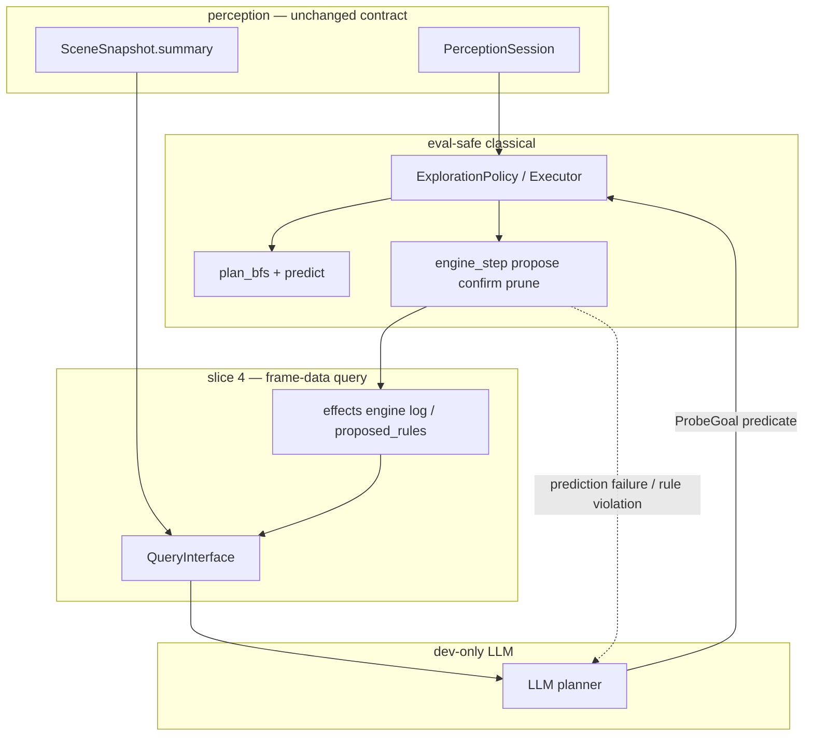

# LLM agent loop — planner + rule proposer (slice 4)

> Closes the live curiosity loop: random exploration → kinematics → **directed
> probes** → **hypothesis rules** → classical verify. Builds on slices 1–3 in
> `docs/brainstorms/effect-model.md` and the perception stack in
> `docs/reports/perception-agent.md`.
>
> **Dev-only:** LLM APIs for planning and rule proposal. **Kaggle eval path**
> stays LLM-free — compiled rules + classical `predict` / BFS, or abstain.

---

## Problem (what slice 3 left open)

Slice 3 gave us a **classical rule engine** (residual → propose / confirm /
prune) wired into live observe. It works for **simple Markovian templates**
(`CounterRule`, `TerminalRule`) when the agent **happens** to visit the right
states with the right `PlanSpec` projection.

What it does **not** do:

| Gap | Why it matters |
|-----|----------------|
| **Passive learning** | Rules appear only on incidental transitions; no directed experiments. |
| **Template ceiling** | Classical propose only emits fixed templates; g50t hidden memory and richer mechanics need hypotheses, not `delta_size=-2` alone. |
| **Navigation ≠ experiment design** | Tier-1 `seek_entity` uses spatial "not reached yet," not "probe this rule." |
| **No closed loop** | Unknown → hypothesis → test → confirmed rule → better predict → smarter probes. |

Slice 4 closes this loop with **one LLM role**: the planner. No separate rule
proposer phase — the planner produces `ProbeGoal` dicts, classical code executes
them, and the engine confirms/prunes rules as before. The scene summary IS the
planner's memory — no separate scratch needed.

---

## Target loop

```text
┌─────────────────────────────────────────────────────────────────┐
│  Phase A — classical cold start (done: Rung 6 + slice 3)          │
│  random actions → registry/catalog → controllable + kinematics   │
└───────────────────────────────┬─────────────────────────────────┘
                                ▼
┌─────────────────────────────────────────────────────────────────┐
│  Phase B — LLM planner (slice 4)                                │
│  read compact scene + engine state → ProbeGoal direction         │
│  "go near entity 17", "try action 4 twice", "sample action 5"   │
│  ⚠ LLM outputs DIRECTION only — never actions                   │
└───────────────────────────────┬─────────────────────────────────┘
                                ▼
┌─────────────────────────────────────────────────────────────────┐
│  Phase C — classical execute                                    │
│  compile ProbeGoal → BFS plan → pop actions step-by-step         │
└───────────────────────────────┬─────────────────────────────────┘
                                ▼
┌─────────────────────────────────────────────────────────────────┐
│  Phase D — classical observe + engine (slice 3)                  │
│  predict vs observed → residual; confirm / prune rules           │
│  if rule violated → report failure_context back to Phase B       │
│  if probe done → report current scene back to Phase B            │
│  if probe exhausted → report failure_context back to Phase B    │
└───────────────────────────────┬─────────────────────────────────┘
                                │
                  ┌─────────────┴─────────────┐
                  │  Classical reports back:    │
                  │  • plan achieved → new dir  │
                  │  • rule violation → replan  │
                  │  • probe exhausted → replan│
                  └─────────────┬─────────────┘
                                ▼
                        back to Phase B
```

**Principle:** LLM **directs** (ProbeGoal — where to go, what to watch).
Classical layer **disposes** (compile → BFS → execute → verify → confirm/prune)
and **reports back** when something happens (plan done, rule violation, probe
exhausted). Never the reverse on the eval path. Future: same loop shape with
richer LLM output — the LLM will also propose rules for classical to verify.

**Memory:** The scene summary IS the planner's memory. No separate scratch
or ProbeState. The LLM sees entity positions, sizes, roles, recent actions,
confirmed rules, and prediction failures — everything it needs to decide
what to probe next.

---

## Slice status (effects + agent)

| Slice | Scope | Status |
|-------|--------|--------|
| 1–3 | Kinematics, hand rules, Markovian engine | ✅ |
| **4** | **LLM planner + query interface + ProbeGoal DSL + rule proposer** | ✅ done |
| 5 (TBD) | Eval bundle: compile confirmed rules, no network | stub |

---

## Architecture



### Package boundaries (unchanged)

- **`perception/`** — observe only; `summary()` remains the LLM-facing contract.
- **`effects/`** — `predict`, rule store, engine lifecycle; accepts **compiled**
  rules from LLM proposer after verify (not raw natural language at predict time).
- **`planning/`** — executes `ProbeGoal`; falls back to `ExplorationPolicy` when LLM fails.
- **`agents/templates/`** — new **`LlmCuriosity`** (or extend `Curiosity`) orchestrates
  LLM calls + classical policy slot.

---

## Phase A — random → kinematics (already shipped)

| Step | Mechanism |
|------|-----------|
| Random cold start | `ExplorationPolicy` `explore_random` until controllable + `min_random_steps` |
| Kinematics | `learn_movement_model` / `learn_effect_context` |
| Basic verify | Pos expectation + `engine_step` on observe (slice 3) |
| Non-Markovian detect | Determinism beacon → `EffectContext.non_markovian` → abstain |

No LLM required for Phase A.

---

## Phase B — LLM planner

### Job

Turn "what is still unknown?" into a **single ProbeGoal predicate** — not a
full game solution.

Examples:

- Target entity 17 (size bar) — `{"dim": "pos", "of": 0, "near": {"of": 17, "radius": 3}}`
- Repeat action 1 four times while watching entity 5 size — `{"dim": "size", "of": 5, "eq": <observed>}`
- After non-Markovian violation on action 5, try action 5 again — `{"action": 5}` (ignores state)

### Input (token-bounded query interface)

Not raw 64×64 grids. Pull-only API over session + effects:

| Query | Purpose | Status |
|-------|---------|--------|
| `scene_summary()` | `SceneSnapshot.summary()` — entities, roles, events, determinism | ✅ shipped |
| `recent_actions(k)` | Last k action ids (+ coords for complex actions) | ✅ shipped |
| `engine_rules()` | Confirmed + proposed rules (formatted like `engine_log`) | ✅ shipped |
| `movement_model()` | Learned motion_by_action, known_blocks summary | ⬜ deferred |
| `recent_residuals(k)` | Last k `(entity, dim, predicted, observed)` if logged | ⬜ deferred |
| `nonmarkov_episodes()` | Determinism violations + surrounding action context | ⬜ deferred |

Implement as `planning/query.py` — one module, read-only, no side effects.

**No `visited_entities()` query needed.** The scene summary already shows
entity positions, sizes, and roles — the LLM can infer what it has and hasn't
explored. Adding a hardcoded `ProbeState` would be premature; if the LLM
repeats probes, we can add structured memory later based on observed failures.

### Output — ProbeGoal predicate

**Shipped (Step 2):** `ProbeGoal` uses predicate dicts, not closed `kind` tags.
See `planning/probe.py` and `docs/reports/slice4-query-interface.md`.

The LLM outputs a JSON dict matching the ProbeGoal predicate schema:

```json
{
  "predicate": {"dim": "pos", "of": 0, "near": {"of": 17, "radius": 3}},
  "max_steps": 50,
  "reason": "probe entity 17 size bar"
}
```

Classical executor resolves relative references, compiles the predicate into a
BFS goal, and runs `plan_bfs`. When the probe finishes (goal reached, prediction
failure, or plan exhausted), the LLM is called again with the updated scene.

### LLM adapter contract

```python
def call_planner(bundle: dict, available_actions: list[int]) -> ProbeGoal | None:
    """Call LLM with query bundle, parse response into ProbeGoal.

    Returns None on parse failure or LLM refusal — caller falls back to
    classical exploration.
    """
```

### Cadence

- **Cold:** every N frames or after divergence / new proposed rule / non-Markovian event.
- **Not** every frame — RHAE budget; cache plan until finished or failed.
- **On prediction failure:** immediately re-call planner with failure context.

---

## Agent loop

**Core principle: LLM directs, classical executes and reports back.**

The LLM planner **never outputs actions**. It outputs a **ProbeGoal** — a
direction like "go near entity 17" or "try action 4 while watching entity 5".
The classical layer (BFS + rule engine) compiles that into concrete actions,
executes them step-by-step, and reports back to the LLM when something happens:

- **Plan achieved** — ProbeGoal predicate satisfied; LLM gets updated scene for next probe.
- **Unexpected** — anything that violates the current rule set (prediction
  failure, rule violation, non-Markovian event); LLM must re-engage immediately.
- **Plan exhausted** — max_steps reached without satisfying predicate; LLM gets failure context.

```text
LlmCuriosity.choose_action:
  ingest → on_observed (verify + engine_step — always runs)
  if phase == random: random action (via ExplorationPolicy)
  elif active_probe_plan: pop next action from probe plan
  elif rule_violation: report to LLM → new ProbeGoal
  elif probe_done_or_exhausted: report to LLM → new ProbeGoal
  else: fall back to classical ExplorationPolicy
  return action
```

**Swap `ExplorationPolicy` behind `Planner` protocol** — the agent composes both:

- **`ExplorationPolicy`** — always present; handles Phase A cold start, classical
  fallback, and engine lifecycle (`on_observed` → verify + `engine_step`).
- **LLM planner** — called only when classical needs direction: after cold start,
  on rule violation, or when a probe finishes/fails. Produces `ProbeGoal`; never actions.
- **`execute_probe`** — classical compilation of ProbeGoal into BFS plan + step-by-step execution.

**Reporting back:** When classical execution encounters a rule violation, the
agent assembles a `failure_context` listing what the rule set predicted vs what
was observed (per entity + dim), and passes it to the next `call_planner` call.

**Now shipped:** The LLM rule proposer is implemented (`planning/llm_rule_proposer.py`,
`call_rule_proposer` in `planning/llm_planner.py`). It proposes rules from unexplained
residuals using the same propose/confirm/prune lifecycle as classical templates.
Eval path uses `NULL_RULE_PROPOSER` (returns `[]`, no network).

---

## Planner memory — why no ProbeState

Previous design had a `ProbeState` dataclass with `reached_entity_ids`,
`probed: set[tuple[int, str]]`, etc. We deliberately omit this because:

1. **The scene IS memory.** Entity positions, sizes, and roles change after each
   step. The LLM sees the current state via `scene_summary()` — it can infer
   what it's explored without a separate tracking set.
2. **Game-specific memory differs.** ls20 needs "which bars I've visited"; g50t
   needs "which action-5 state classes I've probed". Hardcoding `probed:
   set[tuple[int, str]]` assumes dim-level probing is universal — it's not.
3. **YAGNI.** Until the LLM actually repeats probes, we're building infrastructure
   for a problem we haven't observed. If it does repeat, we add structured
   memory then, based on the actual failure mode.

`visited_cells` on `ExplorationPolicy` stays — the BFS frontier needs this for
spatial avoidance. That's classical, not LLM memory.

## Failure context — what classical reports to LLM

When classical execution hits something that violates the current rule set, the
agent assembles a `failure_context` dict for the next `call_planner` call:

```python
failure_context = {
    "type": "rule_violation" | "prediction_failure",
    "violations": [
        {"entity": 5, "dim": "size", "predicted": 3, "observed": 5},
        {"entity": 0, "dim": "pos", "predicted": [5, 3], "observed": [5, 4]},
    ],
    "last_action": 4,
    "previous_probe_reason": "probe entity 17 size bar",
}
```

This is a list of **what turned out different from our rule set** — per entity
and dimension. The LLM uses this to decide what to probe next (e.g., "try
action 4 again while watching entity 5").

On probe exhaustion (goal not reached within max_steps), `violations` is empty
and `type` is `"probe_exhausted"` — the LLM sees the current scene and decides
whether to retry or try a different approach.

---

## Kaggle eval path (slice 5 preview)

Training / dev session produces:

- Compiled `EffectContext` snapshot (rules + movement).
- Optional compiled guard bytecode or frozen rule list.
- `ProbeGoal` is **not** on eval path.

Runtime agent: classical only — same as today's curiosity with a richer rule bag.
If rules insufficient → `predict` abstains (honest non-Markovian).

---

## Implementation sequence (slice 4)

| Step | Deliverable | Status |
|------|-------------|--------|
| 1 | **`planning/query.py`** — read-only query interface over session + ctx | ✅ done |
| 2 | **`planning/probe.py`** — ProbeGoal DSL + `compile_goal` + executor; `effects/guard_parse.py` | ✅ done |
| 3 | **LLM planner adapter** — prompt template + response parser + agent loop wiring | ✅ done |
| 4 | **`agents/templates/llm_curiosity_agent.py`** — orchestration shell | ✅ done |
| 5 | **`planning/llm_rule_proposer.py`** — LLM-backed rule hypothesis proposer with DSL validation, dedup, cooldown | ✅ done |
| 6 | **`planning/llm_planner.py` call_rule_proposer** — orchestrate rule proposal: build prompt → call LLM → parse → validate → dedup | ✅ done |
| 7 | **Tests** — mock LLM fixtures; ls20 + g50t recordings for probe paths | ✅ done |
| 8 | **Scripts** — offline replay with logged LLM I/O for regression | ✅ done |

### Step 4 scope — LlmCuriosity agent shell

**What it is:** An `Agent` subclass that composes `PerceptionSession` +
`ExplorationPolicy` + LLM planner into one `choose_action` loop. It is the
**orchestration shell only** — it does not implement new planning or perception
logic. All the parts it wires together already exist (Steps 1–3).

**What the agent owns:**

| State | Type | Purpose |
|-------|------|---------|
| `session` | `PerceptionSession` | Ingest frames → `SceneSnapshot` (same as Curiosity) |
| `policy` | `ExplorationPolicy` | Classical fallback + engine lifecycle (always runs `on_observed`) |
| `llm_call` | `Callable` | Injected LLM call (dev-only; `LLMClient.chat` or mock) |
| `_probe_plan` | `list[int] \| None` | Action sequence from `execute_probe`; popped step-by-step |
| `_failure_context` | `dict \| None` | What classical reports to LLM on rule violation / probe exhaustion |
| `_phase` | `Literal["random", "llm_directed"]` | Phase gate: random cold start → LLM-directed |

**What `choose_action` does (pseudocode):**

```
1. Handle RESET for NOT_PLAYED / GAME_OVER (same as Curiosity)
2. Ingest frame → session.ingest() → policy.on_observed()
   (engine verify + engine_step always runs — classical owns this)
3. If phase == "random":
     delegate to ExplorationPolicy.decide()
     transition to "llm_directed" once controllable + min_random_steps
4. If active _probe_plan:
     pop next action; return it
5. Check for rule violation since last turn:
     if violation → build failure_context, clear _probe_plan
6. Call LLM planner (call_planner with bundle + failure_context)
     → ProbeGoal | None
7. If ProbeGoal: execute_probe(goal, scene, ctx, actions)
     → action sequence | None
   If sequence: store as _probe_plan, pop first action, return it
8. Fallback: ExplorationPolicy.decide()
```

**What `on_observed` (inside choose_action) reports:**

- `ExplorationPolicy.on_observed(scene)` already runs engine verify + `engine_step`.
- After it returns, the agent checks `policy.status().diverged` and the
  engine log for rule violations → assembles `_failure_context` for the next
  LLM call.

**What is NOT in Step 4:**

- New perception roles or detectors
- New rule templates or engine logic
- LLM rule hypothesis proposal (shipped — `planning/llm_rule_proposer.py` + `call_rule_proposer`)
- Complex action coordinate handling (deferred)
- Eval bundle / Kaggle path (slice 5)
- `ProbeState` / planner scratch (YAGNI)

**Plumbing concern:** `ExplorationPolicy._ctx` (EffectContext) is needed by
`QueryInterface` and `execute_probe`. The agent accesses it from the policy.
If `_ctx` staying private feels wrong, add a public `ctx` property — trivial,
no design impact.

**Removed steps** (merged or deferred):
- ~~Step 3: Planner scratch / ProbeState~~ — removed; scene summary IS memory.
- ~~Step 5: RuleHypothesis + compiler~~ — deferred to after the planner loop works.
- ~~Step 6: LLM rule proposer adapter~~ — merged into future hypothesis step.
- ~~Step 7: LlmCuriosity agent~~ — renumbered to Step 4.
- ~~Step 8: Tests~~ — renumbered to Step 5.
- ~~Step 9: Scripts~~ — renumbered to Step 6.

**Defer:** eval bundle export (slice 5); overlap/`exists` classical template until fixture; RuleHypothesis/compiler until the planner loop is proven.

---

## Tests and fixtures

| Case | Fixture |
|------|---------|
| Query interface returns bounded JSON | synthetic session |
| LLM planner → ProbeGoal → BFS plan found | ls20 recording |
| LLM planner parse failure → classical fallback | synthetic |
| Prediction failure triggers re-planning | ls20 recording |
| Mock LLM planner → probe entity 17 → engine proposes −2 | ls20 |

---

## Out of scope (slice 4)

- LLM on Kaggle eval network path
- Raw canvas / full grid in prompts
- Per-game rule tables in code
- New perception role detectors (use summary + query)
- RHAE-optimal global planning (probes only, not full solve)
- Replacing classical `engine_step` confirm/prune with LLM judgment
- ProbeState / hardcoded planner scratch (scene is memory)
- Separate LLM rule proposer phase (shipped — reuses same propose/confirm/prune lifecycle)
- Complex action coordinate handling (ACTION6/ACTION7 x,y — deferred)
- LLM cadence tuning / staleness heuristics (experiment-driven, not pre-designed)

---

## Artifacts (target after slice 4)

- `planning/query.py` — frame-data query interface ✅
- `effects/dsl.py` — rule DSL for LLM serialization ✅
- `effects/guard_parse.py` — shared guard clause parser ✅
- `planning/probe.py` — ProbeGoal, compile_goal, executor ✅
- `planning/llm_planner.py` — dev LLM → ProbeGoal ✅
- `agents/templates/llm_curiosity_agent.py` ✅
- `tests/unit/test_llm_agent_loop.py` (mocked LLM) ✅
- `scripts/probe_recording.py` — offline DSL testing + LLM I/O logging ✅
- `docs/brainstorms/effect-model.md` slice 4 row → updated ✅

---

## Related docs

- `docs/brainstorms/effect-model.md` — slices 1–3, classical effects
- `docs/reports/perception-agent.md` — perception contract, Rung 6 curiosity, Rung 7 LLM rule proposer
- `docs/reports/slice4-query-interface.md` — Steps 1–2 implementation report
- `AGENTS.md` — offline eval constraint, package layout

---

## Implementation notes — what was actually built

The brainstorm above described the target loop. Here is what shipped and where
it diverges from the original plan.

### Shipped (matches brainstorm)

- **Query interface** (`planning/query.py`): read-only pull API over session +
  effects. Produces bounded JSON bundles for the LLM. Exactly as designed.
- **ProbeGoal DSL** (`planning/probe.py`): predicate dicts, `compile_goal`,
  executor. Near-predicates compile to BFS goals. Matches the brainstorm.
- **LLM planner adapter** (`planning/llm_planner.py`): `call_planner` builds a
  prompt from the scene bundle + failure context, calls the LLM, parses the
  response into a `ProbeGoal`. Validated against live entity IDs. Network-free
  (takes a callable, not an API client).
- **LlmCuriosity agent** (`agents/templates/llm_curiosity_agent.py`): composes
  `PerceptionSession` + `ExplorationPolicy` + LLM planner. Phase gate from
  `random` to `llm_directed`. `choose_action` delegates to the planner when
  classical needs direction, falls back to curiosity otherwise.
- **Cooldown circuit breaker** in `make_rule_proposer`: minimum 5 seconds
  between LLM invocations. Returns `[]` if called too soon.

### Shipped (extends brainstorm)

- **LLM rule proposer** (`planning/llm_rule_proposer.py`): originally deferred
  as a future "richer LLM output" step, but now implemented. The proposer
  consumes unexplained residuals from `engine_step` and generates `Rule`
  hypotheses via the LLM. Key components:

  | Component | What it does |
  |-----------|-------------|
  | `SYSTEM_PROMPT` | DSL syntax reference for the LLM (guard, effect, kind, support) |
  | `parse_proposals` | Extracts `{"rules": [...]}` from raw LLM text (handles fenced JSON, bare JSON) |
  | `validate_proposal` | Checks kind, guard parse, entity ID existence, effect structure, DSL→Rule conversion |
  | `make_rule_proposer` | Factory returning a `RuleProposerFn` with cooldown circuit breaker |
  | `NULL_RULE_PROPOSER` | Eval-path stub returning `[]` (no network) |

  `call_rule_proposer` in `llm_planner.py` orchestrates: build prompt → call LLM
  → parse → validate → dedup against confirmed engine rules. Same propose/confirm/
  prune lifecycle as classical rules. No special treatment for LLM-originated
  proposals.

- **Dedup against confirmed rules**: `_extract_engine_rules` pulls confirmed
  rules from the bundle and skips any LLM proposal that duplicates an existing
  rule key. This prevents the LLM from re-proposing what the engine already
  confirmed.

### Deferred (not yet built)

- **Interaction rules** (collision, push, overlap): the engine confirms terminal
  and counter rules from templates, but richer interaction effects (entity A
  pushes entity B, collision stops movement) are not yet template-proposed or
  LLM-proposed. The DSL supports `delta` effects on arbitrary dimensions, so
  the LLM *could* propose these, but no templates seed them classically.
- **Cadence tuning / staleness heuristics**: the planner is called on every
  probe completion or rule violation. No staleness check yet.
- **`movement_model()` and `recent_residuals()` queries**: listed in the
  brainstorm but not yet in `QueryInterface`. The scene summary carries enough
  for current probes.
- **Eval bundle (slice 5)**: frozen rules + classical predict/BFS, no network.
  `NULL_RULE_PROPOSER` is the eval stub for the proposer path.
- **Complex action coordinates** (ACTION6/ACTION7 with x,y): ProbeGoal
  predicates don't yet handle coordinate parameters.