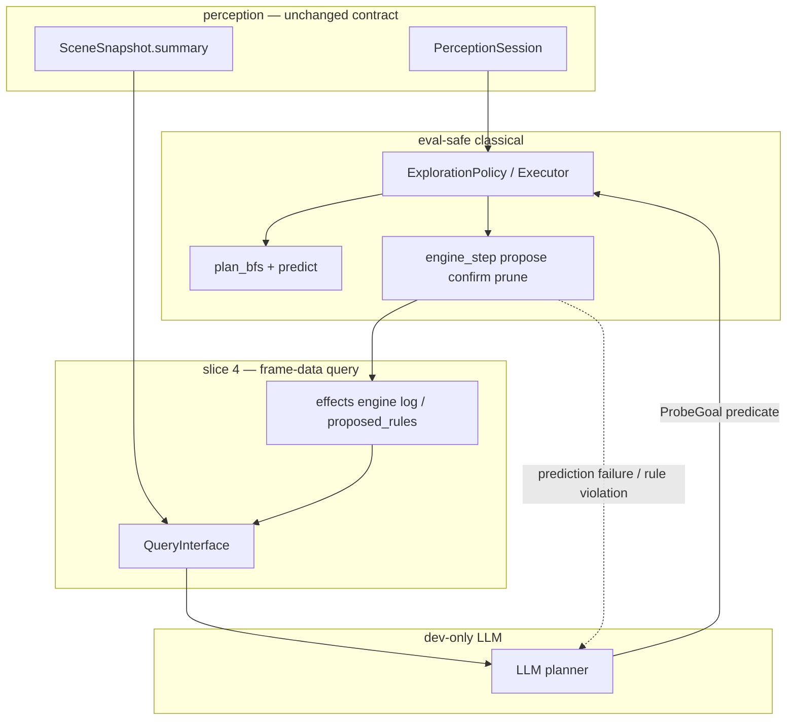

# LLM agent loop — planner + rule proposer (slice 4)

> Closes the live curiosity loop: random exploration → kinematics → **directed
> probes** → **hypothesis rules** → classical verify. Builds on slices 1–3 in
> `docs/brainstorms/effect-model.md` and the perception stack in
> `docs/reports/perception-agent.md`.
>
> **Dev-only:** LLM APIs for planning and rule proposal. **Kaggle eval path**
> stays LLM-free — compiled rules + classical `predict` / BFS, or abstain.

---

## Problem (what slice 3 left open)

Slice 3 gave us a **classical rule engine** (residual → propose / confirm /
prune) wired into live observe. It works for **simple Markovian templates**
(`CounterRule`, `TerminalRule`) when the agent **happens** to visit the right
states with the right `PlanSpec` projection.

What it does **not** do:

| Gap | Why it matters |
|-----|----------------|
| **Passive learning** | Rules appear only on incidental transitions; no directed experiments. |
| **Template ceiling** | Classical propose only emits fixed templates; g50t hidden memory and richer mechanics need hypotheses, not `delta_size=-2` alone. |
| **Navigation ≠ experiment design** | Tier-1 `seek_entity` uses spatial "not reached yet," not "probe this rule." |
| **No closed loop** | Unknown → hypothesis → test → confirmed rule → better predict → smarter probes. |

Slice 4 closes this loop with **one LLM role**: the planner. No separate rule
proposer phase — the planner produces `ProbeGoal` dicts, classical code executes
them, and the engine confirms/prunes rules as before. The scene summary IS the
planner's memory — no separate scratch needed.

---

## Target loop

```text
┌─────────────────────────────────────────────────────────────────┐
│  Phase A — classical cold start (done: Rung 6 + slice 3)          │
│  random actions → registry/catalog → controllable + kinematics   │
└───────────────────────────────┬─────────────────────────────────┘
                                ▼
┌─────────────────────────────────────────────────────────────────┐
│  Phase B — LLM planner (slice 4)                                │
│  read compact scene + engine state → ProbeGoal predicate         │
│  "go near entity 17", "try action 4 twice", "sample action 5"   │
└───────────────────────────────┬─────────────────────────────────┘
                                ▼
┌─────────────────────────────────────────────────────────────────┐
│  Phase C — classical execute                                    │
│  BFS / single-step toward planner goal; record state_before      │
└───────────────────────────────┬─────────────────────────────────┘
                                ▼
┌─────────────────────────────────────────────────────────────────┐
│  Phase D — observe + engine (slice 3)                           │
│  predict vs observed → residual; confirm / prune templates      │
│  if rule violated or prediction failed → back to Phase B         │
└─────────────────────────────────────────────────────────────────┘
                                │
                                └──→ loop back to B with updated scene
```

**Principle:** LLM **proposes** where to go (ProbeGoal predicate). Classical
layer **disposes** (execute, predict, confirm, abstain). Never the reverse on
the eval path.

**Memory:** The scene summary IS the planner's memory. No separate scratch
or ProbeState. The LLM sees entity positions, sizes, roles, recent actions,
confirmed rules, and prediction failures — everything it needs to decide
what to probe next.

---

## Slice status (effects + agent)

| Slice | Scope | Status |
|-------|--------|--------|
| 1–3 | Kinematics, hand rules, Markovian engine | ✅ |
| **4** | **LLM planner + query interface + ProbeGoal DSL** | 🔨 steps 1–3 done; step 4 next |
| 5 (TBD) | Eval bundle: compile confirmed rules, no network | stub |

---

## Architecture



### Package boundaries (unchanged)

- **`perception/`** — observe only; `summary()` remains the LLM-facing contract.
- **`effects/`** — `predict`, rule store, engine lifecycle; accepts **compiled**
  rules from LLM proposer after verify (not raw natural language at predict time).
- **`planning/`** — executes `ProbeGoal`; falls back to `ExplorationPolicy` when LLM fails.
- **`agents/templates/`** — new **`LlmCuriosity`** (or extend `Curiosity`) orchestrates
  LLM calls + classical policy slot.

---

## Phase A — random → kinematics (already shipped)

| Step | Mechanism |
|------|-----------|
| Random cold start | `ExplorationPolicy` `explore_random` until controllable + `min_random_steps` |
| Kinematics | `learn_movement_model` / `learn_effect_context` |
| Basic verify | Pos expectation + `engine_step` on observe (slice 3) |
| Non-Markovian detect | Determinism beacon → `EffectContext.non_markovian` → abstain |

No LLM required for Phase A.

---

## Phase B — LLM planner

### Job

Turn "what is still unknown?" into a **single ProbeGoal predicate** — not a
full game solution.

Examples:

- Target entity 17 (size bar) — `{"dim": "pos", "of": 0, "near": {"of": 17, "radius": 3}}`
- Repeat action 1 four times while watching entity 5 size — `{"dim": "size", "of": 5, "eq": <observed>}`
- After non-Markovian violation on action 5, try action 5 again — `{"action": 5}` (ignores state)

### Input (token-bounded query interface)

Not raw 64×64 grids. Pull-only API over session + effects:

| Query | Purpose | Status |
|-------|---------|--------|
| `scene_summary()` | `SceneSnapshot.summary()` — entities, roles, events, determinism | ✅ shipped |
| `recent_actions(k)` | Last k action ids (+ coords for complex actions) | ✅ shipped |
| `engine_rules()` | Confirmed + proposed rules (formatted like `engine_log`) | ✅ shipped |
| `movement_model()` | Learned motion_by_action, known_blocks summary | ⬜ deferred |
| `recent_residuals(k)` | Last k `(entity, dim, predicted, observed)` if logged | ⬜ deferred |
| `nonmarkov_episodes()` | Determinism violations + surrounding action context | ⬜ deferred |

Implement as `planning/query.py` — one module, read-only, no side effects.

**No `visited_entities()` query needed.** The scene summary already shows
entity positions, sizes, and roles — the LLM can infer what it has and hasn't
explored. Adding a hardcoded `ProbeState` would be premature; if the LLM
repeats probes, we can add structured memory later based on observed failures.

### Output — ProbeGoal predicate

**Shipped (Step 2):** `ProbeGoal` uses predicate dicts, not closed `kind` tags.
See `planning/probe.py` and `docs/reports/slice4-query-interface.md`.

The LLM outputs a JSON dict matching the ProbeGoal predicate schema:

```json
{
  "predicate": {"dim": "pos", "of": 0, "near": {"of": 17, "radius": 3}},
  "max_steps": 50,
  "reason": "probe entity 17 size bar"
}
```

Classical executor resolves relative references, compiles the predicate into a
BFS goal, and runs `plan_bfs`. When the probe finishes (goal reached, prediction
failure, or plan exhausted), the LLM is called again with the updated scene.

### LLM adapter contract

```python
def call_planner(bundle: dict, available_actions: list[int]) -> ProbeGoal | None:
    """Call LLM with query bundle, parse response into ProbeGoal.

    Returns None on parse failure or LLM refusal — caller falls back to
    classical exploration.
    """
```

### Cadence

- **Cold:** every N frames or after divergence / new proposed rule / non-Markovian event.
- **Not** every frame — RHAE budget; cache plan until finished or failed.
- **On prediction failure:** immediately re-call planner with failure context.

---

## Agent loop

```text
LlmCuriosity.choose_action:
  ingest → on_observed (verify + engine_step)
  if phase == random: random action
  elif active_probe_plan: pop next action from BFS plan
  elif prediction_failure or rule_violation: call LLM planner → new ProbeGoal
  elif llm_plan_stale: call LLM planner → new ProbeGoal
  else: fall back to classical ExplorationPolicy
  return action
```

Swap **`ExplorationPolicy`** implementation behind `Planner` protocol:

- **v1 (today):** heuristic seek_entity + frontier.
- **v4:** `LlmDirectedPolicy` consumes `ProbeGoal`, falls back to v1 on LLM failure.

---

## Planner memory — why no ProbeState

Previous design had a `ProbeState` dataclass with `reached_entity_ids`,
`probed: set[tuple[int, str]]`, etc. We deliberately omit this because:

1. **The scene IS memory.** Entity positions, sizes, and roles change after each
   step. The LLM sees the current state via `scene_summary()` — it can infer
   what it's explored without a separate tracking set.
2. **Game-specific memory differs.** ls20 needs "which bars I've visited"; g50t
   needs "which action-5 state classes I've probed". Hardcoding `probed:
   set[tuple[int, str]]` assumes dim-level probing is universal — it's not.
3. **YAGNI.** Until the LLM actually repeats probes, we're building infrastructure
   for a problem we haven't observed. If it does repeat, we add structured
   memory then, based on the actual failure mode.

`visited_cells` on `ExplorationPolicy` stays — the BFS frontier needs this for
spatial avoidance. That's classical, not LLM memory.

---

## Kaggle eval path (slice 5 preview)

Training / dev session produces:

- Compiled `EffectContext` snapshot (rules + movement).
- Optional compiled guard bytecode or frozen rule list.
- `ProbeGoal` is **not** on eval path.

Runtime agent: classical only — same as today's curiosity with a richer rule bag.
If rules insufficient → `predict` abstains (honest non-Markovian).

---

## Implementation sequence (slice 4)

| Step | Deliverable | Status |
|------|-------------|--------|
| 1 | **`planning/query.py`** — read-only query interface over session + ctx | ✅ done |
| 2 | **`planning/probe.py`** — ProbeGoal DSL + `compile_goal` + executor; `effects/guard_parse.py` | ✅ done |
| 3 | **LLM planner adapter** — prompt template + response parser + agent loop wiring | ✅ done |
| 4 | **`agents/templates/llm_curiosity_agent.py`** — orchestration, dev-only API | ⬜ |
| 5 | **Tests** — mock LLM fixtures; ls20 + g50t recordings for probe paths | ⬜ |
| 6 | **Scripts** — offline replay with logged LLM I/O for regression | ⬜ |

**Removed steps** (merged or deferred):
- ~~Step 3: Planner scratch / ProbeState~~ — removed; scene summary IS memory.
- ~~Step 5: RuleHypothesis + compiler~~ — deferred to after the planner loop works.
- ~~Step 6: LLM rule proposer adapter~~ — merged into future hypothesis step.
- ~~Step 7: LlmCuriosity agent~~ — renumbered to Step 4.
- ~~Step 8: Tests~~ — renumbered to Step 5.
- ~~Step 9: Scripts~~ — renumbered to Step 6.

**Defer:** eval bundle export (slice 5); overlap/`exists` classical template until fixture; RuleHypothesis/compiler until the planner loop is proven.

---

## Tests and fixtures

| Case | Fixture |
|------|---------|
| Query interface returns bounded JSON | synthetic session |
| LLM planner → ProbeGoal → BFS plan found | ls20 recording |
| LLM planner parse failure → classical fallback | synthetic |
| Prediction failure triggers re-planning | ls20 recording |
| Mock LLM planner → probe entity 17 → engine proposes −2 | ls20 |

---

## Out of scope (slice 4)

- LLM on Kaggle eval network path
- Raw canvas / full grid in prompts
- Per-game rule tables in code
- New perception role detectors (use summary + query)
- RHAE-optimal global planning (probes only, not full solve)
- Replacing classical `engine_step` confirm/prune with LLM judgment
- ProbeState / hardcoded planner scratch (scene is memory)
- Separate LLM rule proposer phase (deferred)

---

## Artifacts (target after slice 4)

- `planning/query.py` — frame-data query interface ✅
- `effects/dsl.py` — rule DSL for LLM serialization ✅
- `effects/guard_parse.py` — shared guard clause parser ✅
- `planning/probe.py` — ProbeGoal, compile_goal, executor ✅
- `planning/llm_planner.py` — dev LLM → ProbeGoal ✅
- `agents/templates/llm_curiosity_agent.py`
- `tests/unit/test_llm_agent_loop.py` (mocked LLM)
- `scripts/probe_recording.py` — offline DSL testing ✅
- Update `docs/brainstorms/effect-model.md` slice 4 row → points here

---

## Related docs

- `docs/brainstorms/effect-model.md` — slices 1–3, classical effects
- `docs/reports/perception-agent.md` — perception contract, Rung 6 curiosity
- `docs/reports/slice4-query-interface.md` — Steps 1–2 implementation report
- `AGENTS.md` — offline eval constraint, package layout