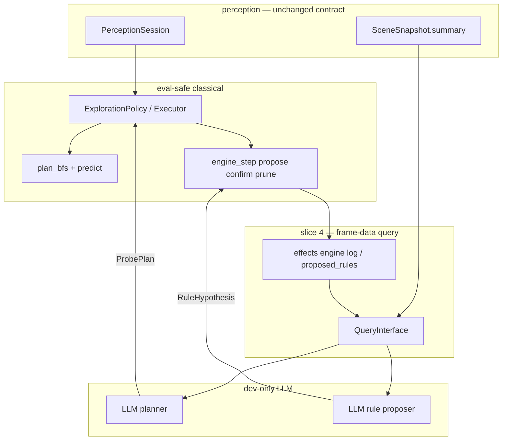

# LLM agent loop — planner + rule proposer (slice 4)

> Closes the live curiosity loop: random exploration → kinematics → **directed
> probes** → **hypothesis rules** → classical verify. Builds on slices 1–3 in
> `docs/brainstorms/effect-model.md` and the perception stack in
> `docs/reports/perception-agent.md`.
>
> **Dev-only:** LLM APIs for planning and rule proposal. **Kaggle eval path**
> stays LLM-free — compiled rules + classical `predict` / BFS, or abstain.

---

## Problem (what slice 3 left open)

Slice 3 gave us a **classical rule engine** (residual → propose / confirm /
prune) wired into live observe. It works for **simple Markovian templates**
(`CounterRule`, `TerminalRule`) when the agent **happens** to visit the right
states with the right `PlanSpec` projection.

What it does **not** do:

| Gap | Why it matters |
|-----|----------------|
| **Passive learning** | Rules appear only on incidental transitions; no directed experiments. |
| **Template ceiling** | Classical propose only emits fixed templates; g50t hidden memory and richer mechanics need hypotheses, not `delta_size=-2` alone. |
| **Navigation ≠ experiment design** | Tier-1 `seek_entity` uses spatial “not reached yet,” not “probe this rule.” |
| **No closed loop** | Unknown → hypothesis → test → confirmed rule → better predict → smarter probes. |

Slice 4 adds **two LLM roles** on top of the existing classical stack — not
new perception ontology (no per-game `Entity` flags beyond optional planner
scratch like `visited`).

---

## Target loop

```text
┌─────────────────────────────────────────────────────────────────┐
│  Phase A — classical cold start (done: Rung 6 + slice 3)          │
│  random actions → registry/catalog → controllable + kinematics   │
└───────────────────────────────┬─────────────────────────────────┘
                                ▼
┌─────────────────────────────────────────────────────────────────┐
│  Phase B — LLM planner (slice 4)                                │
│  read compact scene + engine state → aim / probe plan             │
│  “go near entity 17”, “try action 4 twice”, “sample action 5”   │
└───────────────────────────────┬─────────────────────────────────┘
                                ▼
┌─────────────────────────────────────────────────────────────────┐
│  Phase C — classical execute                                    │
│  BFS / single-step toward planner goal; record state_before      │
│  optional: visited / probed scratch (entity_id, dim)            │
└───────────────────────────────┬─────────────────────────────────┘
                                ▼
┌─────────────────────────────────────────────────────────────────┐
│  Phase D — observe + engine (slice 3)                           │
│  predict vs observed → residual; confirm / prune templates      │
└───────────────────────────────┬─────────────────────────────────┘
                                ▼
┌─────────────────────────────────────────────────────────────────┐
│  Phase E — LLM rule proposer (slice 4)                          │
│  unexplained residuals / non-Markovian episodes → rule hypothesis│
│  compile to structured rules or simulated dims + guards         │
└───────────────────────────────┬─────────────────────────────────┘
                                ▼
┌─────────────────────────────────────────────────────────────────┐
│  Phase F — classical verify hypothesis                          │
│  planner runs confirm probes; engine promotes or prunes           │
│  loop to B with updated ctx + summary                             │
└─────────────────────────────────────────────────────────────────┘
```

**Principle:** LLM **proposes** (where to look, what rule might hold). Classical
layer **disposes** (execute, predict, confirm, abstain). Never the reverse on
the eval path.

---

## Slice status (effects + agent)

| Slice | Scope | Status |
|-------|--------|--------|
| 1–3 | Kinematics, hand rules, Markovian engine | ✅ |
| **4** | **LLM planner + LLM rule proposer + query interface + verify loop** | ⬜ planned |
| 5 (TBD) | Eval bundle: compile confirmed rules, no network | stub |

---

## Architecture



### Package boundaries (unchanged)

- **`perception/`** — observe only; `summary()` remains the LLM-facing contract.
- **`effects/`** — `predict`, rule store, engine lifecycle; accepts **compiled**
  rules from LLM proposer after verify (not raw natural language at predict time).
- **`planning/`** — executes `ProbePlan`; keeps **`visited` / `probed` scratch**
  (sets on policy, not on `Entity`).
- **`agents/templates/`** — new **`LlmCuriosity`** (or extend `Curiosity`) orchestrates
  LLM calls + classical policy slot.

---

## Phase A — random → kinematics (already shipped)

| Step | Mechanism |
|------|-----------|
| Random cold start | `ExplorationPolicy` `explore_random` until controllable + `min_random_steps` |
| Kinematics | `learn_movement_model` / `learn_effect_context` |
| Basic verify | Pos expectation + `engine_step` on observe (slice 3) |
| Non-Markovian detect | Determinism beacon → `EffectContext.non_markovian` → abstain |

No LLM required for Phase A.

---

## Phase B — LLM planner

### Job

Turn “what is still unknown?” into a **short, executable probe plan** — not a
full game solution.

Examples:

- Target entity 17 (size bar) — BFS goal near centroid.
- Repeat action 1 four times while watching entity 5 size.
- After non-Markovian violation on action 5, try action 5 again from same settled state fingerprint class.
- Deprioritize entity 3 (structural HUD) — planner scratch `visited`.

### Input (token-bounded query interface)

Not raw 64×64 grids. Pull-only API over session + effects:

| Query | Purpose |
|-------|---------|
| `scene_summary()` | `SceneSnapshot.summary()` — entities, roles, events, determinism |
| `recent_actions(k)` | Last k action ids (+ coords for complex actions) |
| `movement_model()` | Learned motion_by_action, known_blocks summary |
| `engine_rules()` | Confirmed + proposed rules (formatted like `engine_log`) |
| `recent_residuals(k)` | Last k `(entity, dim, predicted, observed)` if logged |
| `nonmarkov_episodes()` | Determinism violations + surrounding action context |
| `animation_steps(frame)` | `n_subframes`, compact ghost hint (g50t) |
| `settled_diff(f1, f2)` | Symbolic entity pos/size delta between settled frames |
| `visited_entities()` | Planner scratch — ids already probed |

Implement as `perception/query.py` or `planning/llm_context.py` — one module,
read-only, no side effects.

### Output — `ProbePlan` (sketch)

```python
@dataclass
class ProbeGoal:
    kind: str  # "near_entity" | "frontier" | "repeat_action" | "complex_action"
    entity_id: int | None = None
    action: int | None = None
    repeat: int = 1
    coords: tuple[int, int] | None = None  # complex actions only
    reason: str = ""  # for logs / replay

@dataclass
class ProbePlan:
    goals: tuple[ProbeGoal, ...]           # ordered sub-goals
    plan_spec_entities: tuple[int, ...]    # dims to project for engine
    plan_spec_dims: tuple[str, ...]        # e.g. ("pos", "size")
    include_terminal: bool = False
    max_steps: int = 20
```

Classical executor maps `ProbeGoal` → existing BFS / single-action path. When
plan exhausted, call LLM planner again.

### Cadence

- **Cold:** every N frames or after divergence / new proposed rule / non-Markovian event.
- **Not** every frame — RHAE budget; cache plan until finished or failed.

---

## Phase E — LLM rule proposer

### Job

Turn **unexplained observations** into **testable rule hypotheses** richer than
slice-3 templates alone.

Triggers:

- Residual after `engine_step` with no matching proposed template.
- Repeated confirm failure on a proposed template.
- `non_markovian` episode (g50t action 5 class).
- Planner reports “entity X size changes every move but no rule.”

### Input

Same query interface as planner, plus:

- Last probe plan and outcomes (matched / diverged / abstained).
- Current `EffectContext` rule diff.

### Output — `RuleHypothesis` (sketch)

Structured, compilable — not free-form only.

```python
@dataclass
class RuleHypothesis:
    name: str
    kind: str
    # "counter" | "terminal" | "exists" | "latent_dim" | "guard_expr"
    entity_id: int | None
    action: int | None
    guard: dict[str, object]      # pos, action, latent key, history window, ...
    effect: dict[str, object]     # delta_size, terminal, set_dim, ...
    probe_to_confirm: ProbePlan   # minimal experiment to verify
    confidence: str               # low | medium — for logging only
```

**Compilation step (classical, no LLM):**

1. Map known kinds → existing `CounterRule` / `TerminalRule` / future `ExistsRule`.
2. Map `latent_dim` / `guard_expr` → `SceneState.set_dim` + custom guard predicate
   **only after** confirm probe succeeds (eval bundle may ship compiled guards).
3. Reject hypotheses that violate game-agnostic constraints (hard-coded game ids,
   raw pixel conditions).

### Verify loop (Phase F)

1. Run `probe_to_confirm` via classical executor.
2. On each step: `engine_step` + compare hypothesis prediction to observed.
3. **Promote** if K agreeing probes; **prune** on contradiction.
4. Feed promoted rules into `EffectContext` used by `predict` / BFS.

Slice-3 engine remains the **confirmation authority**; LLM is the **generator**.

---

## Planner scratch — `visited` / `probed`

Ephemeral sets on `ExplorationPolicy` or a small `ProbeState` dataclass:

```python
visited_cells: set[Pos]           # already have
reached_entity_ids: set[int]      # replace pos-only reached_targets
probed: set[tuple[int, str]]      # (entity_id, dim) e.g. (17, "size")
```

- Passed into query interface for LLM context.
- **Not** stored on `Entity` in perception — avoids ontology creep.
- Classical frontier / seek_entity can still run when LLM plan is empty.

---

## Agent orchestration

```text
Curiosity / LlmCuriosity.choose_action:
  ingest → on_observed (verify + engine_step)
  if phase == random: random action
  elif probe_plan active: pop classical goal
  elif llm_plan_stale: call LLM planner → new ProbePlan
  if residuals / nonmarkov / planner ask: call LLM rule proposer → queue verify
  return action
```

Swap **`ExplorationPolicy`** implementation behind `Planner` protocol:

- **v1 (today):** heuristic seek_entity + frontier.
- **v4:** `LlmDirectedPolicy` consumes `ProbePlan`, falls back to v1 on LLM failure.

---

## Kaggle eval path (slice 5 preview)

Training / dev session produces:

- Compiled `EffectContext` snapshot (rules + movement).
- Optional compiled guard bytecode or frozen rule list.
- `ProbePlan` is **not** on eval path.

Runtime agent: classical only — same as today’s curiosity with a richer rule bag.
If rules insufficient → `predict` abstains (honest non-Markovian).

---

## Implementation sequence (slice 4)

| Step | Deliverable |
|------|-------------|
| 1 | **`planning/query.py`** — read-only query interface over session + ctx |
| 2 | **`ProbePlan` / `ProbeGoal`** — datatypes + classical executor |
| 3 | **Planner scratch** — `reached_entity_ids`, `probed` |
| 4 | **LLM planner adapter** — prompt + parse `ProbePlan` from query bundle |
| 5 | **`RuleHypothesis` + compiler** — map to rules / `set_dim` |
| 6 | **LLM rule proposer adapter** — prompt + parse + queue verify probes |
| 7 | **`agents/templates/llm_curiosity_agent.py`** — orchestration, dev-only API |
| 8 | **Tests** — mock LLM fixtures; g50t recording for non-Markovian hypothesis path |
| 9 | **Scripts** — offline replay with logged LLM I/O for regression |

**Defer:** eval bundle export (slice 5); overlap/`exists` classical template until fixture.

---

## Tests and fixtures

| Case | Fixture |
|------|---------|
| Query interface returns bounded JSON | synthetic session |
| Classical executor runs `near_entity` goal | ls20 recording |
| Compiler maps counter hypothesis → `CounterRule` | synthetic |
| Mock LLM planner → probe entity 17 → engine proposes −2 | ls20 |
| Mock rule proposer on g50t violation → latent hypothesis → abstain or confirm | g50t |
| Planner scratch `probed` prevents repeat targets | synthetic |

---

## Out of scope (slice 4)

- LLM on Kaggle eval network path
- Raw canvas / full grid in prompts
- Per-game rule tables in code
- New perception role detectors (use summary + query)
- RHAE-optimal global planning (probes only, not full solve)
- Replacing classical `engine_step` confirm/prune with LLM judgment

---

## Artifacts (target after slice 4)

- `planning/query.py` — frame-data query interface
- `planning/probe.py` — `ProbePlan`, executor
- `planning/llm_planner.py` — dev LLM → `ProbePlan`
- `effects/hypothesis.py` — `RuleHypothesis`, compile, verify hooks
- `planning/llm_rule_proposer.py` — dev LLM → `RuleHypothesis`
- `agents/templates/llm_curiosity_agent.py`
- `tests/unit/test_llm_agent_loop.py` (mocked LLM)
- Update `docs/brainstorms/effect-model.md` slice 4 row → points here

---

## Related docs

- `docs/brainstorms/effect-model.md` — slices 1–3, classical effects
- `docs/reports/perception-agent.md` — perception contract, Rung 6 curiosity
- `AGENTS.md` — offline eval constraint, package layout
