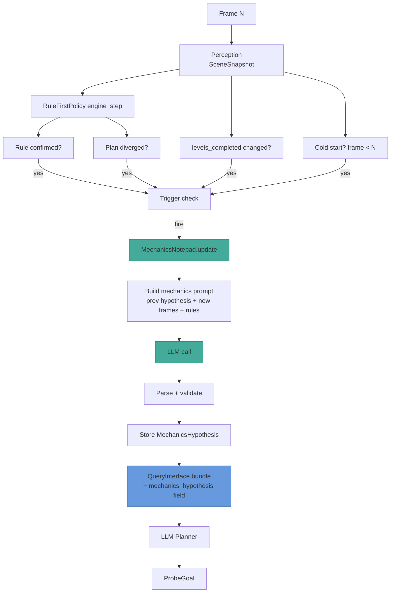

# Game mechanics notepad — persistent objective inference

> **Status**: Implemented
>
> Builds on the experiment results in
> [`scripts/mechanics_prompt_experiment.py`](../../scripts/mechanics_prompt_experiment.py)
> and
> [`scripts/mechanics_iterative_experiment.py`](../../scripts/mechanics_iterative_experiment.py).
> See `.local/experiments/` for saved LLM outputs.

---

## Problem

The agent learns **rules** (constraints: "action 1 moves up 5", "action 5
picks up an object") but has no concept of the **objective** (what the game
is about: "carry objects into the bounded area"). The LLM planner picks
targets procedurally — "navigate to unexplored entity" — without knowing
what the player is *trying to achieve*. This leads to aimless exploration
even when the mechanics are observable.

Experiments confirmed the LLM can infer the objective from a handful of key
frames (images + action legend + scene data), and that a confirm/refute
refinement loop converges to confidence 1.0 within 2-3 stages. The missing
piece is a persistent surface that carries the hypothesis across frames
and feeds it back into subsequent LLM calls.

---

## Experiment evidence

### Single-shot experiments (`mechanics_prompt_experiment.py`)

| Setup | Images | Action legend | Human win | Objective correct? | Conf. |
|-------|--------|--------------|-----------|--------------------|-------|
| Text-only, 6 frames | ❌ | ❌ | ❌ | ❌ vague | 0.8 |
| Multimodal, 6 frames | ✅ | ❌ | ❌ | partial — "collect" not "carry" | 0.8 |
| Multimodal, 6+1 frames | ✅ | ❌ | ✅ | better — "bring to goal" | 0.85 |
| Multimodal, 11+2 frames | ✅ | ✅ | ✅ | ✅ full carry/drop | 0.95 |
| Multimodal, 11 frames | ✅ | ✅ | ❌ | ✅ "push into target zone" | 0.85 |

Key findings:
- **Images are essential.** Text-only missed the bounded area entirely.
- **Action legend is critical.** Without knowing ACTION5 is "unknown/interact", the LLM can't distinguish "carry" from "absorb".
- **Human win frame boosts confidence but isn't required.** Agent-only frames + action legend sufficed.

### Stage experiments (same game, different frame ranges)

| Stage | Frames | Objective correct? | Conf. |
|-------|--------|-------------------|-------|
| Early (0-13) | 5 | ✅ full | 0.90 |
| Mid (24-40) | 9 | partial — "push" not "carry" | 0.80 |
| Late (50-75) | 6 | ❌ hallucinated "invisible entity" | 0.75 |
| Full (0-40) | 11 | ✅ | 0.85 |

**The early stage performed best.** The clean initial board reveals the
puzzle structure. Mid/late frames show messy intermediate states that
obscure the objective. This strongly suggests the notepad should fire
early and refine on evidence, not re-derive from scratch every frame.

### Iterative experiment (`mechanics_iterative_experiment.py`)

4 stages, each seeing only NEW frames + previous hypothesis:

| Stage | Frames | Status | Conf. | Key refinement |
|-------|--------|--------|-------|---------------|
| 0 | 0-5 | initial | 0.7 | Guessed "place into target zone" + "ACTION5 = interact" |
| 1 | 6-13 | **refined** | 0.9 | Learned carry visual: "white block above green entity" |
| 2 | 14-24 | confirmed | 1.0 | Saw full pickup→carry→drop cycle |
| 3 | 25-40 | confirmed | 1.0 | No changes — hypothesis held |

The confirm/refute loop worked. Confidence climbed 0.7→0.9→1.0→1.0. The
hypothesis stabilized by stage 1. Each stage only saw new frames + the
prior hypothesis, keeping prompts bounded.

---

## Target: MechanicsNotepad module

A persistent, LLM-written hypothesis about the game's objective and
mechanics. Survives across frames. Fed back into the planner as a bundle
field. Refined (not re-derived) on each update.

### Data model

```python
@dataclass(frozen=True)
class MechanicsHypothesis:
    objective: str
    key_mechanics: tuple[str, ...]
    progress_signals: tuple[str, ...]
    entity_roles: dict[str, str]
    next_steps: str
    confidence: float
    status: str  # "initial" | "confirmed" | "refined" | "refuted"
    changes: str  # what changed in this update and why
    frame_index: int  # frame when this hypothesis was last updated
```

### Lifecycle

```text
Frame 0-5:  trigger fires (cold start) → LLM call → H0 (initial, conf ~0.7)
Frame 6-13: trigger fires (new interaction) → LLM sees H0 + new frames → H1 (refined, conf ~0.9)
Frame 14+:  trigger fires (levels_completed changed OR new action effect) → H2 (confirmed, conf 1.0)
Frame N+:   no trigger → notepad unchanged → planner reads frozen hypothesis
```

### Trigger conditions (event-driven, not per-frame)

The notepad updates only when new evidence arrives. Four triggers:

1. **Cold start** — after the first N frames (N≈5) when the board is
   clean and the puzzle structure is visible. Best inference window per
   the stage experiments.

2. **`levels_completed` change** — the strongest progress signal.
   Unambiguously means "you did something right." The LLM sees what
   action preceded the increment and can confirm the objective.

3. **New action effect discovered** — when the rule proposer confirms a
   new rule for an action that was previously unknown (especially
   ACTION5-type interactions). The mechanics LLM should see "ACTION5
   picks up objects" and refine the hypothesis.

4. **Divergence / plan failure** — when the planner's probe plan fails
   repeatedly. May indicate the objective hypothesis is wrong (the agent
   is trying to reach a target that doesn't advance the game). Trigger
   a re-evaluation.

**Not a trigger**: every frame. The stage experiments showed late frames
add noise. The hypothesis should be stable once confirmed.

### What the mechanics LLM sees (per update)

- **Previous hypothesis** (if exists) — full JSON, for refinement
- **New frames since last update** — grid images + scene summaries,
  capped at 8 frames (most recent first). Keeps prompt bounded; the
  experiments showed 5-11 frames is sufficient for inference.
- **Action legend** — which actions are known movement vs unknown/interact
- **`levels_completed` delta** — flagged if it changed
- **Newly confirmed rules** — rules confirmed since last update
  (e.g., "ACTION5 → pick up" gives the mechanics LLM concrete evidence)
- **Current `levels_completed` and game state**

### What the mechanics LLM outputs

```json
{
  "status": "confirmed | refined | refuted",
  "changes": "<what changed and why, referencing specific evidence>",
  "objective": "<one-sentence description>",
  "key_mechanics": ["..."],
  "progress_signals": ["..."],
  "entity_roles": {"role": "how to identify it"},
  "next_steps": "<advisory — what to try next>",
  "confidence": 0.0-1.0
}
```

### How the planner uses it

The hypothesis enters the planner's scene bundle as a new field
`mechanics_hypothesis` (compact string — the `objective` + `next_steps`).
The planner's system prompt gains one paragraph:

> If a `mechanics_hypothesis` is provided, prefer targets that advance
> it. `next_steps` is advisory — translate it into a target predicate
> if feasible. If the hypothesis has low confidence, still explore
> broadly to gather evidence for the next mechanics update.

The planner does NOT depend on the hypothesis — it falls back to
procedural exploration if the hypothesis is absent or low-confidence.

---

## Architecture



### New files

| File | Purpose |
|------|---------|
| `planning/mechanics_notepad.py` | `MechanicsNotepad` class — holds hypothesis, trigger logic, LLM call, parse/validate |
| `planning/mechanics_prompt.py` | Prompt construction (system prompt + per-stage user message builder) |

### Modified files

| File | Change |
|------|--------|
| `planning/query.py` | `QueryInterface.bundle()` — add `mechanics_hypothesis` field from notepad |
| `planning/llm_planner.py` | `_SYSTEM_PROMPT` — add paragraph about using the hypothesis; `_build_messages` — include hypothesis in user message |
| `agents/templates/llm_curiosity_agent.py` | Instantiate `MechanicsNotepad`, call `.update()` in `_perceive` or `_try_propose_rules` when trigger fires, pass hypothesis to query bundle |

### No changes to

- `effects/` — the rule engine is unaffected
- `planning/exploration.py` / `planning/rule_first.py` — policies unchanged
- `planning/probe.py` / `planning/search.py` — ProbeGoal and BFS unchanged
- `entity/` — entity layer unchanged (color_changed piping is a separate task)

---

## Incremental plan (3 PRs)

| PR | Scope | Risk |
|----|-------|------|
| 1 | `MechanicsNotepad` class + prompt builder + offline test against recordings (no agent wiring) | Low — standalone, testable against recordings |
| 2 | Wire notepad into agent: trigger check in `_perceive`, hypothesis in query bundle, planner prompt paragraph | Medium — touches agent loop + planner prompt |
| 3 | Trigger tuning: cold-start threshold, rule-confirmation hook, divergence hook | Low — parameter adjustment after PR 2 validates |

### PR 1 — MechanicsNotepad standalone

**Goal:** a class that can be tested offline against recordings, exactly
reproducing the iterative experiment results.

**Deliverables:**
- `planning/mechanics_notepad.py` — `MechanicsNotepad` with:
  - `__init__(llm_call, vision_enabled)` 
  - `should_trigger(frame_index, levels_completed, prev_levels_completed, new_confirmed_rules, diverged) -> bool`
  - `update(recording_frames, scene_snapshots, action_legend, prev_hypothesis) -> MechanicsHypothesis`
  - `hypothesis` property — current frozen hypothesis or None
- `planning/mechanics_prompt.py` — system prompt + `build_messages()` 
  (extracted from the experiment scripts, productionized)
- Tests: replay a recording, call `update()` at trigger points, assert
  the hypothesis converges to the correct objective

**Validation:** run against `wa30-ee6fef47.*.recording.jsonl` and
confirm the output matches `.local/experiments/iterative_final_hypothesis.json`.

### PR 2 — Agent wiring

**Goal:** the notepad runs live in the agent loop and the planner sees it.

**Deliverables:**
- `agents/templates/llm_curiosity_agent.py`:
  - Instantiate `MechanicsNotepad` in `__init__`
  - In `_perceive` or `_try_propose_rules`: check trigger, call `notepad.update()`
  - Pass `notepad.hypothesis` to `QueryInterface` 
- `planning/query.py`: `bundle()` includes `mechanics_hypothesis` field
  (compact: `objective` + `next_steps` + `confidence`)
- `planning/llm_planner.py`: system prompt paragraph about using the hypothesis

**Validation:** run `LLM_VISION=true uv run main.py --agent=llmcuriosityv2 --game=wa30-ee6fef47`,
check `logs.log` for mechanics notepad updates, check `.llm.jsonl` for the
mechanics call prompts/responses, confirm the planner's targets shift
toward the objective.

### PR 3 — Trigger tuning

**Goal:** tune trigger conditions based on real testing of PR 2.

Keep it simple — start with the 4 triggers from PR 2 (cold start,
`levels_completed` change, new rule confirmed, divergence) and a single
cooldown parameter (minimum frames between updates). Test across
multiple games, observe trigger frequency, and adjust thresholds based
on what actually happens. Defer more complex logic (confidence-based
update frequency, etc.) until we have data.

---

## Open questions (defer to implementation)

1. **Cross-level knowledge transfer.** When the agent solves level 1 and
   moves to level 2, entity IDs change but the game family (e.g., "carry
   puzzle") is the same. Should the notepad persist across levels with
   entity IDs abstracted away? This is the "knowledge layer" you mentioned
   — worth a separate brainstorm after the notepad works within a single
   level.

2. **color_changed piping.** The reconciler detects color changes
   (`entity/reconciler.py:452`) but discards them at `build_merge_map`.
   Piping `color_changed` into `Entity.meta` → `SceneSnapshot.summary()`
   → bundle is a small safe change that would give the mechanics LLM
   explicit color-transition evidence. Deferred to a separate PR.

3. **Entity role persistence.** The grouping LLM already infers roles
   (`"player", "obstacle", "goal", "container"`, etc.) but discards them
   after grouping adjudication. Persisting these onto `Entity.meta` would
   give the mechanics LLM a head start. Deferred — the mechanics LLM
   infers roles well from images alone per the experiments.

4. **Prompt size budget.** Each mechanics update sends ~5-11 grid images
   (~1-2KB base64 each) + scene text. At 4 triggers per game this is
   ~40KB total — well within budget. But if triggers fire too often
   the cumulative cost grows. The cooldown in PR 3 addresses this.

5. **Trigger on `levels_completed` decrease.** If the agent loses a
   level (score goes down), should that trigger a refutation? Depends
   on whether the game family has win/loss states — needs more game
   variety to decide.

---

## What's NOT in scope

- **Knowledge layer / cross-level transfer.** The notepad works within
  a single level. Cross-level persistence (abstracting entity IDs,
  matching game families) is a follow-up.
- **Planner dependency on the hypothesis.** The planner uses the
  hypothesis as advisory context, not a hard constraint. It still
  falls back to procedural exploration. Making the planner *depend*
  on the hypothesis is a later step once we trust the inference quality.
- **Rule engine changes.** The mechanics notepad reads confirmed rules
  as evidence but does not modify the rule engine.