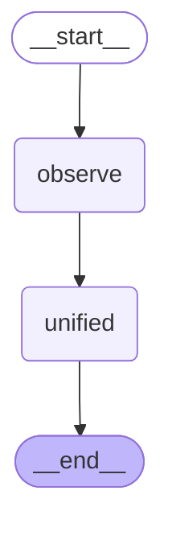
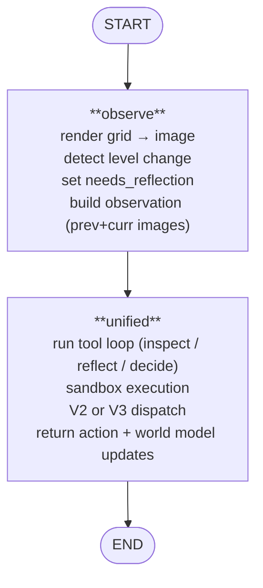
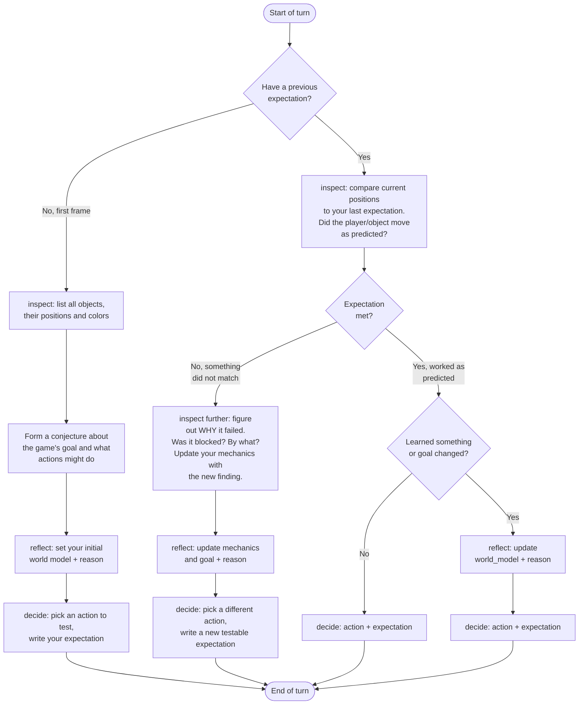
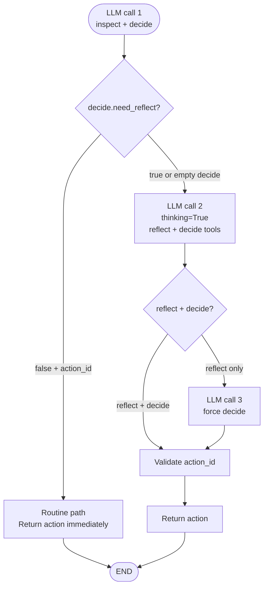

# LangGraph Unified Agent - Design Document

> Architecture and data flow for the LangGraphUnifiedAgent (langgraphunified).
> Last updated: 2026-08-16

---

## 1. Overview

A tool-calling LLM agent for ARC-AGI-3 that merges reflection and planning into a
single LangGraph node. Unlike the vision agent's 4-node workflow (observe →
reflect → plan → experiment), the unified agent uses only two nodes: observe and
unified. The unified node runs an iterative tool loop where the LLM calls
`inspect()` to examine game state and `decide()` (or `reflect()` + `decide()`) to
commit an action.

The agent is **LLM-only**  -  no perception pipeline, no rule engine, no BFS. All
reasoning happens in the LLM. The classical layers (perception, effects,
planning) are not used. Segmentation is provided by `optitrack/atoms.py` for the
sandbox, and grid images are rendered by `vision/render.py` for multimodal input.

Two operational modes exist:

- **V2** (`use_routing=False`, default): 2 tools  -  `inspect` + `decide` with a
  nested `world_model` object. The `reflect` boolean inside `decide` controls
  whether the world model is updated.
- **V3** (`use_routing=True`): 3 tools  -  `inspect` + `reflect` + `decide`. The
  `decide` tool has a `need_reflect` flag that routes to either a routine path
  (single LLM call) or a reflect path (up to 4 LLM calls with extended
  thinking).

Registered as `langgraphunified` in `agents/__init__.py:AVAILABLE_AGENTS`.
Run with `uv run main.py --agent=langgraphunified --game=<game_id>`.

---

## 2. Workflow Graph

### Auto-generated (from `draw_mermaid()`)



### Annotated



**Routing:** The graph is strictly linear. `unified` always returns a plain
`dict` with the action and updated state. No `Command` routing is used at the
graph level; all routing happens inside the unified node's tool loop.

---

## 3. Frame Lifecycle

### The `self.frames` list

The base class `Agent.main()` owns the frame list:

```python
while not self.is_done(self.frames, self.frames[-1]):
    action = self.choose_action(self.frames, latest_frame)
    if frame := self.take_action(action):
        self.append_frame(frame, action)  # appends result to self.frames
```

**Critical invariant:** `self.frames[-1]` is always the current game state
from iteration 1+. The base class appends each action's result via
`append_frame` *before* the next `choose_action` call. So `latest_frame`
(from `arc_env.observation_space`) is the same state as `frames[-1]`  -  it's
redundant from iteration 1+.

| Iteration | `self.frames` | `latest_frame` | `frames[-1]` |
|-----------|---------------|----------------|--------------|
| 0 | `[FrameData(levels_completed=0)]` | `obs_0` (initial) | empty placeholder (no grid) |
| 1 | `[empty, frame_0]` | `frame_0` | `frame_0` (current) |
| 2 | `[empty, frame_0, frame_1]` | `frame_1` | `frame_1` (current) |

### Iteration 0: the empty placeholder

At iteration 0, `self.frames = [FrameData(levels_completed=0)]`  -  an empty
placeholder with no grid. `latest_frame` is the initial observation (not yet
in `self.frames`). `LangGraphUnifiedAgent.choose_action` detects this with a
`getattr(frames[-1], "frame", None)` guard and appends `latest_frame` to
`frames` before passing to the workflow:

```python
current_frames = frames
if not frames or not getattr(frames[-1], "frame", None):
    current_frames = [*frames, latest_frame]
```

From iteration 1+, `frames[-1]` has a grid, so `current_frames = frames`
(passed through unchanged  -  no duplication).

### Reasoning injection

After the workflow returns, `choose_action` injects reasoning into
`GameAction.reasoning`:

```python
action.reasoning = {
    "plan": str(self._state.get("plan", ""))[:8000],
    "action_id": action.value,
    "expectation": str(self._state.get("expectation", ""))[:2000],
    "needs_reflection": bool(self._state.get("needs_reflection", False)),
}
```

This is recorded in the ARC engine log and the `.recording.jsonl` sidecar.

---

## 4. Node Design

### Observe (`agents/langgraph_vision_agent/observe.py`)

Reused from the vision agent without modification. See
`docs/reports/langgraph-vision-agent.md` for full details.

**Key outputs:**
- `observation`  -  multimodal content blocks (image + caption) for the current
  frame, or `[prev_image, prev_caption, action_caption, curr_image,
  curr_caption]` when a previous frame is available.
- `needs_reflection`  -  `True` on first frame, on level change, or when the
  planner requests it.
- `history`  -  rolling list of `"frame N: action=X, Y cells changed"`, capped at
  `max_history` (default 5).
- `frame_index`  -  incremented by 1.

### Unified (`nodes/unified.py`)

The core node. Runs up to `unified_max_tool_calls` (default 12) iterations of a
tool loop. Each iteration calls the LLM with the current toolset, processes any
tool calls, and either loops again or returns an action.

#### Tool loop

```
for call_idx in range(max_tool_calls):
    1. Call LLM with tools + messages
    2. Extract tool_calls from response
    3. If no tool_calls → nudge (1 retry), then fallback
    4. Deduplicate: keep only first tool call per function name
    5. If "inspect" present with "decide"/"reflect" → process inspect only, loop
    6. If "inspect" only → run sandbox, append result, loop
    7. If "decide" (V2) → parse, validate, return action
    8. If "reflect" / "decide" (V3) → routing dispatch (see below)
```

**Nudge:** If the LLM returns no tool calls, a nudge message
("Please call inspect() or decide().") is appended. If the second attempt also
fails, the loop breaks and falls back to a random action.

**Deduplication:** `_deduplicate_tool_calls` keeps only the first tool call per
function name. If both `inspect` and `decide`/`reflect` appear in the same
response, only `inspect` is processed and the loop continues.

#### V2 mode (`use_routing=False`)

Tools: `INSPECT_TOOL` + `DECIDE_V2_TOOL`.

The `decide` tool has a nested `world_model` object with these required fields:

| Field | Type | Description |
|-------|------|-------------|
| `actions` | `list[str]` | What each available action does, e.g. "1=UP (confirmed)" |
| `goal` | `str` | Current goal following the template "[VERB] [TARGET] at [POSITION] to [PURPOSE]. Done when [CONDITION]." |
| `goal_status` | `str` (enum) | One of: `discovering`, `in_progress`, `blocked`, `completed` |
| `mechanics` | `list[str]` | Confirmed rules, tagged with [HIGH/MEDIUM/LOW] |
| `mechanics_summary` | `str` | One-paragraph summary |
| `tactical` | `list[str]` | Tactical observations and next goals |
| `tactical_summary` | `str` | One-sentence strategy summary |

The `reflect` boolean inside `decide` controls whether the world model is
updated. If `reflect=True`, the node replaces mechanics, tactical, actions,
goal, and goal_status with the values from the tool call (capped at config
limits). If `reflect=False`, the previous state carries forward unchanged.

**V2 prompt flowchart (from `UNIFIED_SYSTEM_PROMPT`):**



#### V3 mode (`use_routing=True`)

Tools: `INSPECT_TOOL` + `REFLECT_TOOL` + `DECIDE_V3_TOOL`.

The `decide` tool in V3 is slim: `action_id`, `expectation`, and `need_reflect`.
Routing dispatch:



- **Routine path:** `decide` with `action_id` + `need_reflect=false` → action
  is validated and returned immediately (1 LLM call total).
- **Reflect path:** `decide` with `need_reflect=true` (or empty decide with no
  `action_id`) → a second LLM call is made with `thinking=True` and the
  `reflect` + `decide` tools. If the second call has `reflect` only, a third
  call forces `decide`. Up to 4 LLM calls total for the reflect path.

When both `inspect` and `decide`/`reflect` appear in the same response, only
`inspect` is processed and the loop continues.

**V3 prompt flowchart (from `ROUTING_SYSTEM_PROMPT`):**

```mermaid
flowchart TD
    START([Start of turn]) --> Q1{Have a previous\nexpectation?}
    Q1 -->|No, first frame| INSPECT_NEW[inspect: list all objects,\ntheir positions and colors]
    Q1 -->|Yes| INSPECT_CMP[inspect: compare current positions\nto your last expectation.\nDid the player/object move\nas predicted?]

    INSPECT_NEW --> DECIDE_NEW[decide: need_reflect=true\n(first frame - initialize\nworld model)]
    DECIDE_NEW --> END_REFLECT([Follow-up call:\nreflect + decide\nwith extended thinking])

    INSPECT_CMP --> Q2{Expectation\nmet?}
    Q2 -->|Yes, worked as\npredicted| Q_NEW{Learned something new\nor goal changed?}
    Q_NEW -->|No, routine| DECIDE_ROUTINE[decide: action_id + expectation\nneed_reflect=false]
    Q_NEW -->|Yes, need to\nupdate model| DECIDE_REFLECT1[decide: need_reflect=true]
    DECIDE_REFLECT1 --> END_REFLECT

    Q2 -->|No, something\ndid not match| INVESTIGATE[inspect further: figure\nout WHY it failed.\nWas it blocked? By what?]
    INVESTIGATE --> DECIDE_REFLECT2[decide: need_reflect=true\n(explain the failure)]
    DECIDE_REFLECT2 --> END_REFLECT

    DECIDE_ROUTINE --> END([End of turn])
    END_REFLECT --> END
```

#### 5-repeat action guard

If the same `action_id` appears 5+ consecutive times in `history`,
`needs_reflection` is forced to `True`:

```python
consecutive = 0
for h in reversed(action_history):
    if f"action={action_id}" in h:
        consecutive += 1
    else:
        break
if consecutive >= 5:
    needs_reflection = True
```

This is logged as a warning: "frame=N action=X repeated 5 times; forcing
reflection".

#### Fallback

If the tool loop is exhausted (max tool calls reached) or an LLM error occurs,
a random action from `available_actions` is returned with a warning log:
"frame=N unified exhausted M tool calls; random fallback action=X".

#### `_build_user_content`

Constructs the multimodal user message sent to the LLM each turn. Contains:

- Frame index
- Available actions
- Last expectation
- Recent history (last 5 entries)
- Mechanics bullets + mechanics summary
- Tactical bullets + tactical summary
- Actions bullets (max `max_action_entries`)
- Goal + goal status
- Reflection-required notice (if `force_reflect`)
- Observation image blocks (from the observe node)

The `observation` field is typed as `str` in `UnifiedState` but at runtime
holds multimodal content blocks (list of `image_url` + `text` dicts).

#### `history_cache`

A closure-scoped list inside `make_unified_node` that persists across turns
within a single game:

```python
history_cache: list[dict[str, Any]] = []
# Each entry: {"action": int, "objects": tuple, "adjacency": frozenset}
```

It is appended every time an action is committed (including fallback actions).
It dies when the graph is re-instantiated (new game). The sandbox receives
`list(history_cache)` so the LLM can inspect past frames' objects and
adjacency.

---

## 5. State Schema

```python
class UnifiedState(TypedDict, total=False):
    available_actions: list[int]
    frame_index: int
    observation: str                      # at runtime: multimodal content blocks
    mechanics: list[str]                    # durable game rules
    mechanics_summary: str
    tactical: list[str]                     # long-term strategy guide
    tactical_summary: str
    actions: list[str]                      # action descriptions per ID
    goal: str
    goal_status: str
    reflect_reason: str
    plan: str
    history: list[str]                      # rolling action log (max 5)
    action: GameAction | None
    node_path: list[str]
    last_action_id: int
    prev_grid: list[list[int]] | None       # for cell-change detection
    prev_levels_completed: int | None
    expectation: str
    frames: list[FrameData]                 # frame history; [-1]=current, [-2]=prev
    needs_reflection: bool
```

**Additions vs the vision agent's `GameState`:**

| Field | Description |
|-------|-------------|
| `actions` | Descriptions of what each action does, e.g. "1=UP (confirmed)" |
| `goal` | Current goal following the template |
| `goal_status` | One of `discovering`, `in_progress`, `blocked`, `completed` |
| `reflect_reason` | Why reflection was triggered (V3) |

**State persistence:** `LangGraphUnifiedAgent` stores `self._state = dict(output)`
after each `workflow.invoke()`. This carries mechanics, tactical, history, goal,
and other fields forward across frames. `node_path` is reset to `[]` each frame.

---

## 6. Sandbox & Vision Pipeline

### The `inspect` sandbox

The `inspect` tool runs Python code in a restricted sandbox (reuses
`agents/langgraph_vision_agent/sandbox.py`). Three variables are preloaded:

| Variable | Type | Description |
|----------|------|-------------|
| `objects` | `tuple[dict, ...]` | Detected objects in the current frame. Each dict has `color`, `size`, `centroid`, `bbox`, `hash`. |
| `adjacency` | `frozenset[tuple[int, int]]` | Index pairs of objects that share an edge (4-connected). |
| `history` | `list[dict]` | Past frames from `history_cache`. Each entry has `action`, `objects`, `adjacency`. |

The LLM uses `print()` to return output. The sandbox has a timeout of
`unified_sandbox_timeout` seconds (default 10.0).

### Segmentation (`optitrack/atoms.py`)

`extract_atoms(grid)` performs connected-component labeling on the 64×64 grid
and produces atoms (objects) with color, size, centroid, bounding box, and a
shape+color hash. This is the same segmentation approach used by the Duck
Harness (ARC-AGI-3 Milestone 1 winner).

### Grid rendering (`vision/render.py`)

- `grid_to_image(grid, scale=8)`  -  64×64 color-index grid → 512×512 PIL Image
  using `ARCADE_PALETTE` (16 colors). See `docs/reports/vision.md` for the
  palette table.
- `image_to_base64(img)`  -  PIL Image → base64 PNG string.
- `make_image_block(b64)`  -  OpenAI multimodal content block.

The observe node renders previous and current frames as image blocks when both
are available, so the LLM can see the transition.

---

## 7. Observability

Four sidecar files per recording, all sharing the same GUID:

| File | Contents |
|------|----------|
| `*.recording.jsonl` | Game frames, actions, and `scene_state` (serialized LangGraph state) |
| `*.llm.jsonl` | Every LLM call with full messages/response. `kind` is `"unified"`. |
| `*.logs.log` | Structured logs at decision points (observe, unified node) |
| `*.images/` | Reflector images (when recording is enabled; see vision agent doc) |

### Quick diagnostics

```bash
# Which frames triggered reflection?
grep "needs_reflection=True" *.logs.log

# What did the unified node decide?
grep "node=unified" *.logs.log

# Did the tool loop exhaust or fallback?
grep "unified exhausted" *.logs.log

# Was the 5-repeat guard triggered?
grep "repeated 5 times; forcing reflection" *.logs.log

# Which tool calls were made per frame?
jq 'select(.frame_index == 7) | {kind, tool_calls}' *.llm.jsonl

# How many LLM calls per frame (V3 reflect path)?
jq '{frame: .frame_index, kind, chars: (.messages | map(.content | if type == "string" then length else (map(.text // "") | join("") | length) end) | add)}' *.llm.jsonl
```

See `docs/reports/recording-format.md` for the full recording format reference.

---

## 8. Configuration

`UnifiedAgentConfig` (defaults shown):

| Setting | Default | Description |
|---------|---------|-------------|
| `max_actions` | `60` | Action budget per game |
| `unified_max_tokens` | `4096` | Token budget for the unified LLM call |
| `unified_max_tool_calls` | `12` | Max tool loop iterations per frame |
| `unified_sandbox_timeout` | `10.0` | Sandbox execution timeout in seconds |
| `llm_thinking` | `True` | Enable LLM thinking mode |
| `llm_temperature` | `0.5` | Sampling temperature |
| `llm_top_p` | `0.95` | Nucleus sampling parameter |
| `render_scale` | `8` | Grid upscale factor (64×64 → 512×512) |
| `vision_enabled` | `True` | Always on (no text-only mode) |
| `max_history` | `5` | History entries passed to the LLM |
| `max_tactical` | `10` | Max tactical entries |
| `max_mechanics` | `20` | Max mechanics entries |
| `max_action_entries` | `10` | Max action description entries |
| `use_routing` | `False` | Enable V3 routing dispatch (3 tools) |
| `decide_thinking` | `True` | Enable thinking on the final decide call in V3 reflect path |

Override via YAML file (`LANGGRAPH_UNIFIED_CONFIG` env var) or constructor.

### LLM server

The agent uses `LLMClient` (OpenAI-compatible). Configure via:

```bash
export LLM_BASE_URL=http://localhost:1234/v1
export LLM_MODEL=google/gemma-4-31b
```

**Image token budget:** Gemma 4 needs sufficient image tokens to read the grid
accurately. At low budgets, it hallucinates (e.g., misidentifies which object
moved, confuses direction). Use `--image-max-tokens 1120` when starting
llama-server (or equivalent for your backend).

---

## 9. Known Limitations

- **Direction confusion:** Gemma 4 31B sometimes misreads movement direction from
  grid images (says "down" when the object moved "up"). Higher image token
  budgets help but don't eliminate this.

- **Tactical momentum / stuck behavior:** Once the LLM writes "continuing to
  move right" in tactical, it tends to keep choosing the same action. The world
  model carry-forward can reinforce stuck behavior. The 5-repeat guard and
  flowchart prompt help but aren't 100% reliable.

- **Free-text vs structured state tradeoff:** The Duck Harness uses free-text
  labeled blocks for its world model, which gives flexibility but risks the LLM
  omitting sections. Our structured `world_model` object (V2) enforces fields but
  adds schema complexity. For small models (Gemma 4), fewer required fields is
  better. V3 addresses this by splitting reflection into a separate tool.

- **Grid boundary blindness:** The LLM sees column 63 but doesn't always connect
  that to "can't move further right." No explicit boundary info is in the prompt.
  The Duck Harness has the same issue.

- **V2 world_model schema complexity:** The nested `world_model` object in V2
  has 7 required fields. Small models struggle to populate all of them correctly
  in every `decide()` call, leading to partial or malformed updates.

- **V3 routing adds latency:** The reflect path in V3 can make up to 4 LLM calls
  per frame (initial decide → reflect+decide → forced decide). At 60-120 seconds
  per call on local hardware, this can exceed practical time budgets. The
  routine path (1 call) is fast, but the reflect path is expensive. V3 routing
  was introduced specifically to address the LLM-not-comparing-frames problem
  (lessons learned from duck-harness experiments).

- **No horizontal exploration bias:** The agent tends to test actions 1 and 2
  (typically up/down) and rarely tries 3, 4, 5 (left/right/other) unless forced
  by the goal or guard rules.

- **No goal inference:** The agent doesn't articulate win conditions from first
  principles. It explores movement mechanics but doesn't hypothesize what the
  objective is beyond the goal template.

- **Single-game sessions:** State resets between games. No cross-game learning
  (mechanics don't carry over).

---

## 10. File Map

| File | Purpose |
|------|---------|
| `agents/langgraph_unified_agent/agent.py` | `LangGraphUnifiedAgent`  -  `Agent` subclass, `choose_action` wrapper, reasoning injection |
| `agents/langgraph_unified_agent/graph.py` | `build_workflow()`  -  2-node StateGraph builder, `_with_path_tracking` |
| `agents/langgraph_unified_agent/state.py` | `UnifiedState` TypedDict  -  state schema with `actions`, `goal`, `goal_status`, `reflect_reason` |
| `agents/langgraph_unified_agent/services.py` | `create_services()`  -  wires `planner_call` as unified LLM callable with `kind="unified"` |
| `agents/langgraph_unified_agent/config.py` | `UnifiedAgentConfig`  -  runtime settings, `load_config()` with `LANGGRAPH_UNIFIED_CONFIG` |
| `agents/langgraph_unified_agent/prompts.py` | `UNIFIED_SYSTEM_PROMPT` (V2, 246 lines) and `ROUTING_SYSTEM_PROMPT` (V3, 213 lines) |
| `agents/langgraph_unified_agent/tools.py` | OpenAI-compatible tool schemas: `INSPECT_TOOL`, `DECIDE_V2_TOOL`, `REFLECT_TOOL`, `DECIDE_V3_TOOL` |
| `agents/langgraph_unified_agent/nodes/unified.py` | Unified node  -  tool loop, V2/V3 dispatch, routing, 5-repeat guard, fallback |
| `agents/langgraph_unified_agent/__init__.py` | Package init (empty) |
| `agents/langgraph_vision_agent/observe.py` | Observe node  -  reused from vision agent (grid rendering, level detection, reflection trigger) |
| `agents/langgraph_vision_agent/sandbox.py` | Sandbox execution  -  `run_sandboxed()`, `atoms_to_dicts()`, `compute_adjacency()` |
| `agents/langgraph_vision_agent/logging.py` | `log_node()`, `log_frame()`, `extract_state_for_recording()` |
| `agents/langgraph_vision_agent/services.py` | `AgentServices` dataclass, `call_with_retry()` |
| `optitrack/atoms.py` | `extract_atoms()`  -  connected-component segmentation for the sandbox |
| `vision/palette.py` | `ARCADE_PALETTE`  -  canonical 16-color RGBA tuples |
| `vision/render.py` | `grid_to_image`, `image_to_base64`, `make_image_block` |
| `agents/recorder.py` | `Recorder`  -  `*.recording.jsonl`, `*.llm.jsonl`, `*.logs.log`, `*.images/` sidecars |
| `agents/agent.py` | `Agent` base class  -  `main()` loop, `choose_action` contract, `append_frame` |
| `agents/__init__.py` | `AVAILABLE_AGENTS` registry  -  `langgraphunified` entry |

(End of file)
