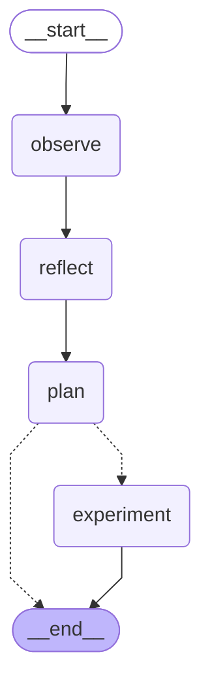
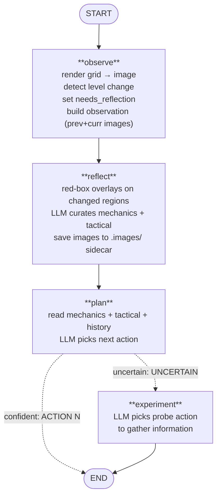

# LangGraph Vision Agent — Design Document

> Architecture and data flow for the `LangGraphVisionAgent` (`llmcuriosityv2`).
> Last updated: 2026-08-05

---

## 1. Overview

A vision-first LLM agent for ARC-AGI-3. Unlike the perception-based
`LlmCuriosity` agent (which segments objects and builds symbolic state), this
agent feeds raw grid images directly to a multimodal LLM and lets it reason
about what it sees.

Four LangGraph nodes form the workflow:

1. **Observe** — render the current grid as an image, detect level changes,
   decide whether reflection is needed.
2. **Reflect** — compare previous and current frame with red-box overlays,
   curate mechanics and tactical lists via LLM.
3. **Plan** — read mechanics/tactical/history, pick the next action. Confident
   → return action. Uncertain → route to experiment.
4. **Experiment** — LLM picks a probe action to gather information.

The agent is **LLM-only** — no perception pipeline, no rule engine, no BFS.
All reasoning happens in the LLM. The classical layers (perception, effects,
planning) are not used.

---

## 2. Workflow Graph

### Auto-generated (from `draw_mermaid()`)



### Annotated



**Routing:** `plan` returns a plain `dict` when confident (→ END) or
`Command(goto="experiment")` when uncertain (→ experiment node). The
`_plan_router` function in `graph.py` handles this.

---

## 3. Frame Lifecycle

### The `self.frames` list

The base class `Agent.main()` owns the frame list:

```python
while not self.is_done(self.frames, self.frames[-1]):
    action = self.choose_action(self.frames, latest_frame)
    if frame := self.take_action(action):
        self.append_frame(frame, action)  # appends result to self.frames
```

**Critical invariant:** `self.frames[-1]` is always the current game state
from iteration 1+. The base class appends each action's result via
`append_frame` *before* the next `choose_action` call. So `latest_frame`
(from `arc_env.observation_space`) is the same state as `frames[-1]` — it's
redundant from iteration 1+.

| Iteration | `self.frames` | `latest_frame` | `frames[-1]` |
|-----------|---------------|----------------|--------------|
| 0 | `[FrameData(levels_completed=0)]` | `obs_0` (initial) | empty placeholder (no grid) |
| 1 | `[empty, frame_0]` | `frame_0` | `frame_0` (current) |
| 2 | `[empty, frame_0, frame_1]` | `frame_1` | `frame_1` (current) |

### Iteration 0: the empty placeholder

At iteration 0, `self.frames = [FrameData(levels_completed=0)]` — an empty
placeholder with no grid. `latest_frame` is the initial observation (not yet
in `self.frames`). `LangGraphVisionAgent.choose_action` detects this with a
`getattr(frames[-1], "frame", None)` guard and appends `latest_frame` to
`frames` before passing to the workflow:

```python
current_frames = frames
if not frames or not getattr(frames[-1], "frame", None):
    current_frames = [*frames, latest_frame]
```

From iteration 1+, `frames[-1]` has a grid, so `current_frames = frames`
(passed through unchanged — no duplication).

### What the nodes see

- `frames[-1]` = current frame (after last action)
- `frames[-2]` = frame before last action (the "previous" frame)
- `len(frames) >= 3` → red-box path (both frames available for diffing)
- `len(frames) < 3` → text fallback (first frame, no previous to compare)

### The `latest_frame` state field (removed)

The original design had a separate `latest_frame` state field. This caused a
bug: the reflector compared `frames[-1]` with `latest_frame`, but they were
the same state → diff was always 0. The field was removed; `frames` is now
the single source of truth.

---

## 4. Node Design

### Observe (`observe.py`)

Renders the current grid as a multimodal image block. When a previous frame
exists (`len(frames) >= 3`), renders both previous and current frames so the
planner can see the transition.

**Key outputs:**
- `observation` — multimodal content blocks (image + caption) for the
  current frame, or `[prev_image, prev_caption, action_caption, curr_image,
  curr_caption]` when a previous frame is available.
- `needs_reflection` — `True` on first frame, on level change, or when the
  planner requests it (`REFLECT: yes`).
- `history` — rolling list of `"frame N: action=X, Y cells changed"`, capped
  at `max_history` (default 5).
- `frame_index` — incremented by 1.

**Reflection trigger:** `observe_signal = is_first_frame or level_changed`.
The planner can also set `needs_reflection=True` via `REFLECT: yes` in its
response, which carries through to the next frame's observe node.

### Reflect (`nodes/reflect.py`)

The core reasoning node. When `needs_reflection=True`, it:

1. Extracts `prev_frame = frames[-2]` and `latest_frame = frames[-1]`.
2. Finds changed regions between the two grids.
3. Renders both grids with **red bounding boxes** around changed regions.
4. Saves the boxed images as PNGs to the `.images/` sidecar (when configured).
5. Sends both images + the current mechanics/tactical lists to the LLM.
6. Parses the LLM response into `MECHANICS`, `MECHANICS_SUMMARY`,
   `TACTICAL`, `TACTICAL_SUMMARY`.

**Prompt design:**

- **MECHANICS** — durable game rules. Each entry should be something that,
  if the planner knew it, would change what action it picks. Examples:
  "Action 1 moves the player up", "Blue blocks block movement",
  "Pink line is a boundary". The LLM is told to maintain the list (keep,
  modify, or drop entries) and not discard existing mechanics unless
  proven wrong.

- **TACTICAL** — long-term strategy guide. Answers "What is this game
  about?" and "What should I do to progress?" Updated each frame based on
  what's been learned. Examples: "Try action 3 to test horizontal movement",
  "Player is stuck against a blue wall — need to go around".

**Image labels:** `PREVIOUS frame (before action)` / `CURRENT frame (after
action)` — no frame numbers (which caused off-by-one confusion in earlier
versions).

**Red-box explanation:** The prompt explicitly tells the LLM that the red
boxes are annotations showing where pixels changed, not part of the game.
The grid colors inside the boxes are the real game state.

**No-op path:** When `needs_reflection=False`, the reflect node returns `{}`
immediately — no LLM call, no image save.

**Image saving:** When `services.images_dir` is set (recorder present), the
reflector saves `frame-{N}-reflector-prev.png` and `frame-{N}-reflector-curr.png`
to the `.images/` sidecar. Save failures are caught and logged as warnings
(non-blocking).

### Plan (`nodes/plan.py`)

Reads mechanics summary, tactical summary, current plan, recent history, and
available actions. Sends the observation images + context to the LLM.

**Two response modes:**
- `ACTION <id> because <reason>` → confident. Returns the action, sets
  `expectation` and `needs_reflection` from `EXPECT:` and `REFLECT:` lines.
- `UNCERTAIN because <reason>` → uncertain. Returns `Command(goto="experiment")`
  with the uncertainty reason.

**Fallbacks:** LLM failure or parse failure → random action from
`available_actions`.

### Experiment (`nodes/experiment.py`)

Called when the planner is uncertain. Prompts the LLM with the uncertainty
reason, available actions, and recent history. The LLM picks a probe action
to gather information.

**Fallback:** LLM failure or parse failure → random action from
`available_actions`.

---

## 5. State Schema

```python
class GameState(TypedDict, total=False):
    available_actions: list[int]
    frame_index: int
    observation: str | list[dict]       # multimodal content blocks
    mechanics: list[str]                # durable game rules
    mechanics_summary: str
    tactical: list[str]                 # long-term strategy guide
    tactical_summary: str
    plan: str                           # last planner/experimenter reasoning
    history: list[str]                  # rolling action log (max 5)
    uncertain_about: str | None
    needs_reflection: bool
    action: GameAction | None
    node_path: list[str]
    last_action_id: int
    prev_grid: list[list[int]] | None   # for cell-change detection
    prev_levels_completed: int | None
    expectation: str
    frames: list[FrameData]             # frame history; [-1]=current, [-2]=prev
```

**State persistence:** `LangGraphVisionAgent` stores `self._state = dict(output)`
after each `workflow.invoke()`. This carries mechanics, tactical, history, and
other fields forward across frames. `node_path` is reset to `[]` each frame.

---

## 6. Vision Pipeline

### Grid rendering (`vision/render.py`)

- `grid_to_image(grid, scale=8)` — 64×64 color-index grid → 512×512 PIL Image
  using `ARCADE_PALETTE` (16 colors). See `docs/reports/vision.md` for the
  palette table.
- `image_to_base64(img)` — PIL Image → base64 PNG string.
- `make_image_block(b64)` — OpenAI multimodal content block
  (`{"type": "image_url", "image_url": {"url": "data:image/png;base64,..."}}`).

### Red-box overlays

- `find_changed_regions(prev_grid, curr_grid)` — returns bounding boxes of
  changed regions.
- `draw_boxes_on_grid(grid, regions, scale=8)` — renders the grid with red
  rectangles around the given regions. The grid colors inside the boxes are
  original; only the outline is red.

### Image sidecar (`.images/`)

When recording is enabled, `Recorder.images_dir_path()` returns a directory
path (suffix swap: `.recording.jsonl` → `.images`). The reflector saves
`frame-{N}-reflector-prev.png` and `frame-{N}-reflector-curr.png` to this
directory on each reflection. These are the exact images the LLM saw — useful
for visual debugging and verifying the reflector's reasoning.

---

## 7. Observability

Four sidecar files per recording, all sharing the same GUID:

| File | Contents |
|------|----------|
| `*.recording.jsonl` | Game frames, actions, and `scene_state` (serialized LangGraph state) |
| `*.llm.jsonl` | Every LLM call (planner, reflector, experimenter) with full messages/response |
| `*.logs.log` | Structured logs at decision points (observe, reflect, plan, experiment) |
| `*.images/` | Reflector images (`frame-N-reflector-prev.png`, `frame-N-reflector-curr.png`) |

### Quick diagnostics

```bash
# What mechanics/tactical did the reflector produce?
jq -r '.data.scene_state.langgraph_state.mechanics[]' *.recording.jsonl

# Which frames triggered reflection?
grep "needs_reflection=True" *.logs.log

# What did the planner decide?
grep "node=plan" *.logs.log

# What images did the reflector see?
ls *.images/

# Why was the planner uncertain?
grep "node=plan.*uncertain=True" *.logs.log
```

See `docs/reports/recording-format.md` for the full recording format reference.

---

## 8. Configuration

`VisionAgentConfig` (defaults shown):

| Setting | Default | Description |
|---------|---------|-------------|
| `vision_enabled` | `True` | Always on (no text-only mode) |
| `max_history` | `5` | History entries passed to planner |
| `max_tactical` | `10` | Max tactical entries |
| `max_mechanics` | `20` | Max mechanics entries |
| `max_actions` | `60` | Action budget per game |
| `llm_thinking` | `False` | Enable LLM thinking mode |
| `planner_max_tokens` | `512` | Token budget for planner |
| `reflector_max_tokens` | `8192` | Token budget for reflector |
| `experimenter_max_tokens` | `512` | Token budget for experimenter |
| `render_scale` | `8` | Grid upscale factor (64×64 → 512×512) |

Override via YAML file (`LANGGRAPH_VISION_CONFIG` env var) or constructor.

### LLM server

The agent uses `LLMClient` (OpenAI-compatible). Configure via:

```bash
export LLM_BASE_URL=http://localhost:1234/v1
export LLM_MODEL=google/gemma-4-31b
```

**Image token budget:** Gemma 4 needs sufficient image tokens to read the
grid accurately. At low budgets, it hallucinates (e.g., misidentifies which
object moved, confuses direction). Use `--image-max-tokens 1120` when
starting llama-server (or equivalent for your backend).

---

## 9. Known Limitations

- **Direction confusion:** Gemma 4 31B sometimes misreads movement direction
  from grid images (says "down" when the object moved "up"). Higher image
  token budgets help but don't eliminate this.
- **Mechanics drift on blocked frames:** When an action produces 0 cells
  changed, the LLM may drop the action mapping ("Action 1 doesn't work")
  instead of recognizing it as a blocking event. The prompt instructs the LLM
  to maintain the list, but this is not always followed.
- **No horizontal exploration bias:** The agent tends to test actions 1 and 2
  (typically up/down) and rarely tries 3, 4, 5 (left/right/other) unless the
  experiment node forces it.
- **No goal inference:** The agent doesn't articulate win conditions. It
  explores movement mechanics but doesn't hypothesize what the objective is.
- **Single-game sessions:** State resets between games. No cross-game
  learning (mechanics don't carry over).

---

## 10. File Map

| File | Purpose |
|------|---------|
| `agents/langgraph_vision_agent/agent.py` | `LangGraphVisionAgent` — `Agent` subclass, `choose_action` wrapper |
| `agents/langgraph_vision_agent/graph.py` | `build_workflow()` — StateGraph builder, `_plan_router`, `draw_mermaid()` |
| `agents/langgraph_vision_agent/state.py` | `GameState` TypedDict — state schema |
| `agents/langgraph_vision_agent/services.py` | `AgentServices` dataclass, `create_services()`, `call_with_retry()` |
| `agents/langgraph_vision_agent/config.py` | `VisionAgentConfig` — runtime settings |
| `agents/langgraph_vision_agent/prompts.py` | System prompts for planner, reflector, experimenter |
| `agents/langgraph_vision_agent/observe.py` | Observe node — grid rendering, level detection, reflection trigger |
| `agents/langgraph_vision_agent/nodes/reflect.py` | Reflect node — red-box overlays, mechanics/tactical curation |
| `agents/langgraph_vision_agent/nodes/plan.py` | Plan node — action selection, confident/uncertain routing |
| `agents/langgraph_vision_agent/nodes/experiment.py` | Experiment node — probe action selection |
| `agents/langgraph_vision_agent/logging.py` | `log_node()`, `log_frame()`, `extract_state_for_recording()` |
| `vision/palette.py` | `ARCADE_PALETTE` — canonical 16-color RGBA tuples |
| `vision/render.py` | `grid_to_image`, `image_to_base64`, `make_image_block`, `find_changed_regions`, `draw_boxes_on_grid` |
| `agents/recorder.py` | `Recorder` — `*.recording.jsonl`, `*.llm.jsonl`, `*.logs.log`, `*.images/` sidecars |
| `agents/agent.py` | `Agent` base class — `main()` loop, `choose_action` contract, `append_frame` |