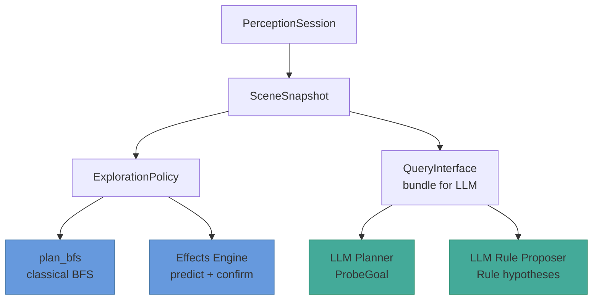
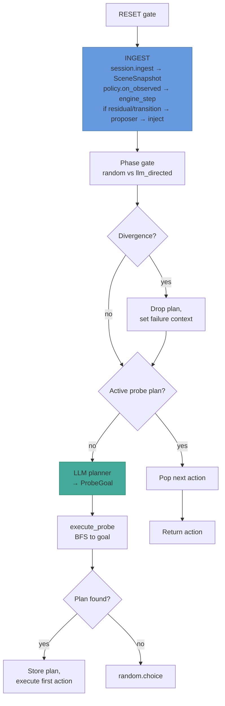
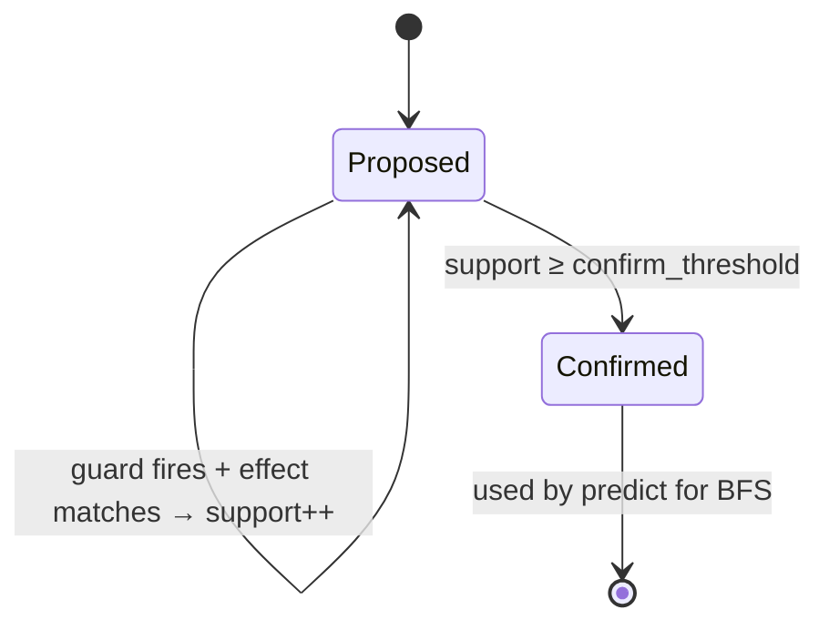
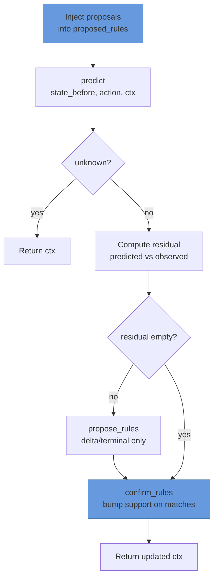
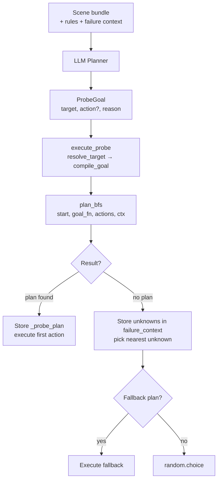
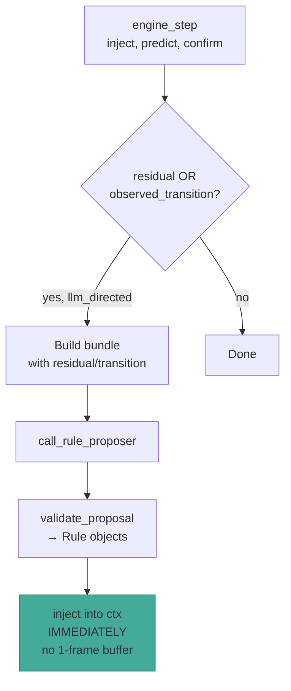
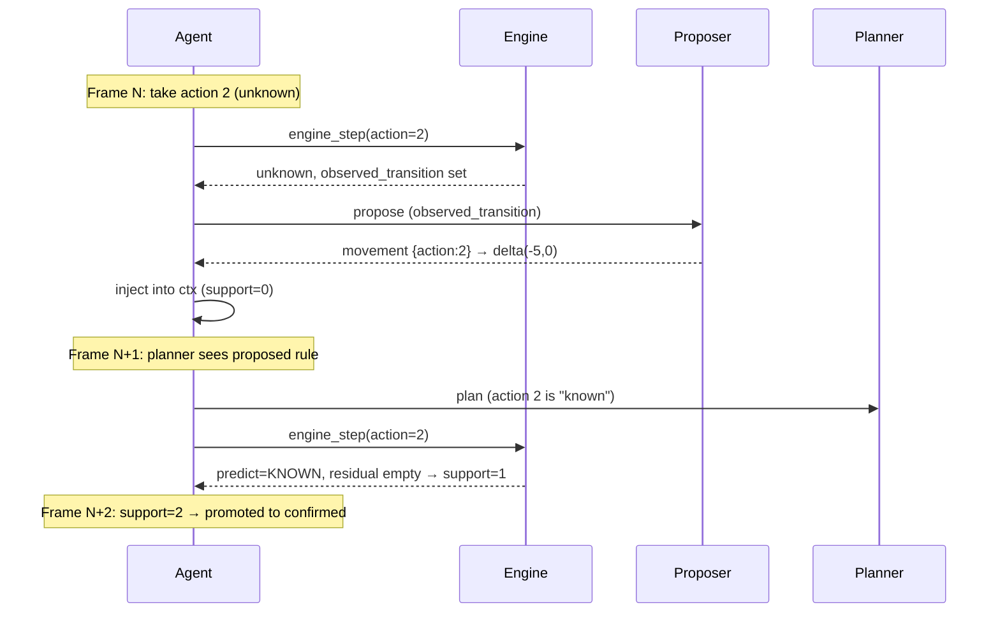
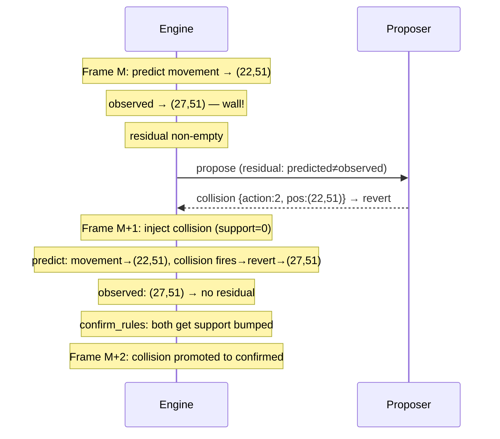

# LLM Curiosity Agent — Design Document

> Architecture and data flow for the `LlmCuriosity` agent.
> Last updated: 2026-06-24

---

## 1. Overview

Perception-first, LLM-directed agent for ARC-AGI-3. Four components:

1. **Perception** — segment objects, track across frames, detect controllable entity.
2. **Effects engine** — predict next states, compute residuals, confirm/prune rules.
   LLM proposer is the sole rule source in the LLM-directed phase.
3. **LLM planner** — proposes exploration goals (`ProbeGoal`) from symbolic scene bundles.
4. **LLM rule proposer** — hypothesizes new rules from residuals and observed transitions.

The LLM is **dev-only**. On the Kaggle eval path, `NULL_RULE_PROPOSER` replaces
the proposer and the planner falls back to classical BFS.

> **Core principle:** LLMs propose, the interaction loop disposes. The LLM never
> sees raw grids — only compact symbolic bundles. The engine verifies everything
> against real observations.

---

## 2. Architecture



### Layer 1 — Perception

`perception/session/` — ingests raw frames, maintains object registry, emits
`SceneSnapshot` with entities, roles, events, step observations.

### Layer 2 — ExplorationPolicy

`planning/exploration.py` — owns the effects context and BFS.

- **Random cold start:** before controllable entity is detected, pick random
  actions. Classical learner (`learn_effect_context`) bootstraps initial rules.
- **LLM-directed:** LLM planner drives. `decide()` is NOT called. Policy runs
  `engine_step` on each observation and provides BFS for probe plan execution.

### Layer 3 — Agent orchestration

`agents/templates/llm_curiosity_agent.py` — phase transitions, probe plan
execution, LLM cooldown, failure context.

---

## 3. Agent loop (per frame)



---

## 4. Effects engine

### 4.1 Rule types

| Kind | Guard | Effect | Example |
|------|-------|--------|---------|
| `movement` | action + optional pos | delta/set on `pos` | "Action 1 → move up 5" |
| `collision` | action + pos | revert `pos` | "Action 1 into wall → stay" |
| `terminal` | action + pos | set terminal state | "Action 3 at exit → win" |
| `delta` | action + optional pos | delta on any dim | "Action 5 → size +1" |

### 4.2 Rule lifecycle



No automatic pruning. LLM handles refinement via collision rules. Wrong proposed
rules die naturally (never get support bumped).

### 4.3 Prediction

`predict` checks **both confirmed and proposed** rules. If no movement rule
guard matches, returns `Prediction(state, unknown=True)` — the curiosity signal.

Proposed rules make actions "known" so `confirm_rules` can bump their support.
Without this, unknown actions stay unknown forever.

### 4.4 engine_step



### 4.5 Two proposer triggers

- **Residual non-empty** — prediction was wrong. LLM sees the mismatch,
  can propose a collision rule or refine the rule.
- **Observed transition** — unknown action was taken. LLM sees
  `(before, action, after)`, can propose a movement rule.

---

## 5. LLM planner



### ProbeGoal

```
ProbeGoal:
  target: dict   # DSL predicate: near entity, at coords, dim=value, or conjunction
  action: int?   # unknown action to try at target (None = navigate only)
  reason: str
```

### Failure context

When BFS fails, stored as:
```
{ type: "unreachable" | "rule_violation" | "probe_exhausted",
  unknowns: [capped to 5],     # (action, state) pairs where predict=unknown
  last_action, previous_probe_reason }
```

`unknowns` is capped at 5 entries to prevent LLM context explosion (BFS can
produce hundreds of unknown states, each serializing all entity dimensions).

### Fallback unknown probe

On BFS failure, pick the **nearest** unknown (Manhattan distance) and build a
fallback `ProbeGoal` targeting its state with its action. Ensures the agent
tries unknown actions instead of navigating to unreachable targets.

---

## 6. LLM rule proposer



### Immediate injection (no buffer)

Proposals are injected directly into the effects context right after the
proposer returns — not buffered for the next frame. This eliminates the
1-frame delay where `record_step` would use stale context.

### Learning loop example



### Collision refinement (wall)



---

## 7. Key design decisions

**No classical learner in LLM-directed phase.** `learn_effect_context` only
runs during cold start. The LLM proposer is the sole rule source afterward.

**Proposed rules visible to predict.** Without this, unknown actions stay
unknown forever — `confirm_rules` never runs on them.

**No automatic pruning.** LLM handles refinement. Wrong proposed rules die
naturally (never get support bumped).

**Immediate proposal injection.** Proposals enter `proposed_rules` on the
same frame the proposer returns. No 1-frame buffer delay.

**Ctx synced after every engine_step.** Prevents stale context in the
LLM-directed phase where `decide()` is never called.

**LLM-first control flow.** In LLM-directed phase, `decide()` is NOT called.
LLM always drives. Emergency fallback: `random.choice(actions)`.

**Bundle size caps.** `unknowns` capped at 5, `proposed_rules` capped at 20
in the LLM bundle. Prevents context explosion (BFS can produce hundreds of
unknown entries, each with full state fingerprints).

---

## 8. Key files

| Component | File |
|-----------|------|
| Agent entry point | `agents/templates/llm_curiosity_agent.py` |
| Exploration policy | `planning/exploration.py` |
| BFS search | `planning/search.py` |
| ProbeGoal DSL | `planning/probe.py` |
| LLM planner | `planning/llm_planner.py` |
| LLM rule proposer | `planning/llm_rule_proposer.py` |
| Query bundle | `planning/query.py` |
| Effects prediction | `effects/predict.py` |
| Effects context | `effects/context.py` |
| Effects engine | `effects/engine.py` |
| Rule DSL | `effects/dsl.py` |
| Rule types | `effects/rules.py` |
| SceneState | `effects/state.py` |
| Perception session | `perception/session/` |

---

## 9. LLM call logging

Every LLM call is recorded to a sibling `.llm.jsonl` file for offline analysis.

Why separate from the recording? Reconstructing prompts from `scene` +
`effect_context` requires replaying perception — slow and fragile. Raw messages
are ~2–5 KB × ~50–150 calls/game and make "what did the LLM see?" a one-line
`jq` query.

Event fields: `timestamp`, `guid`, `seq`, `frame_index`, `kind` (planner |
rule_proposer), `trigger`, `messages`, `response_raw`, `latency_ms`, `ok`,
`error`, `truncated`. Messages/responses are truncated at 20 KB per field.

Module: `agents/templates/llm_logging.py` — `LlmCallLogger`, `wrap_llm_call`,
`Recorder.llm_log_path()`.