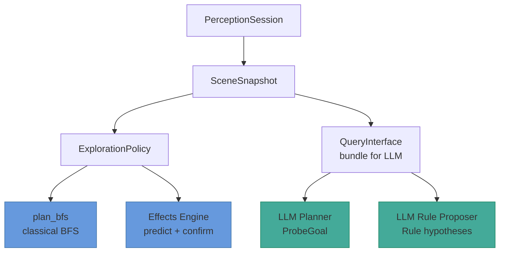
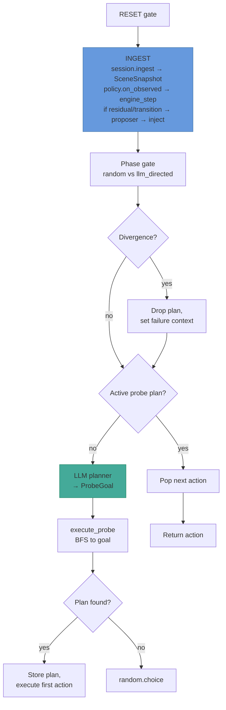
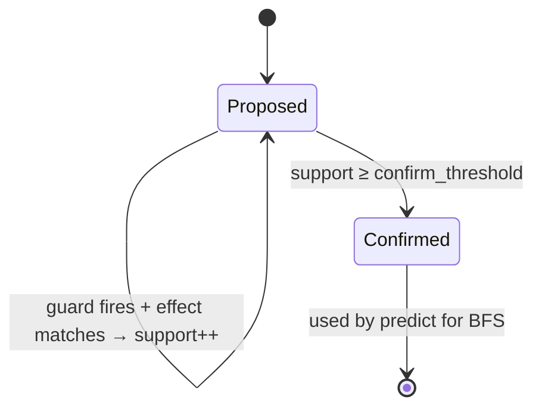
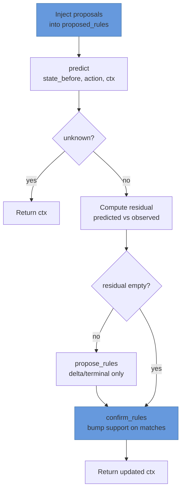
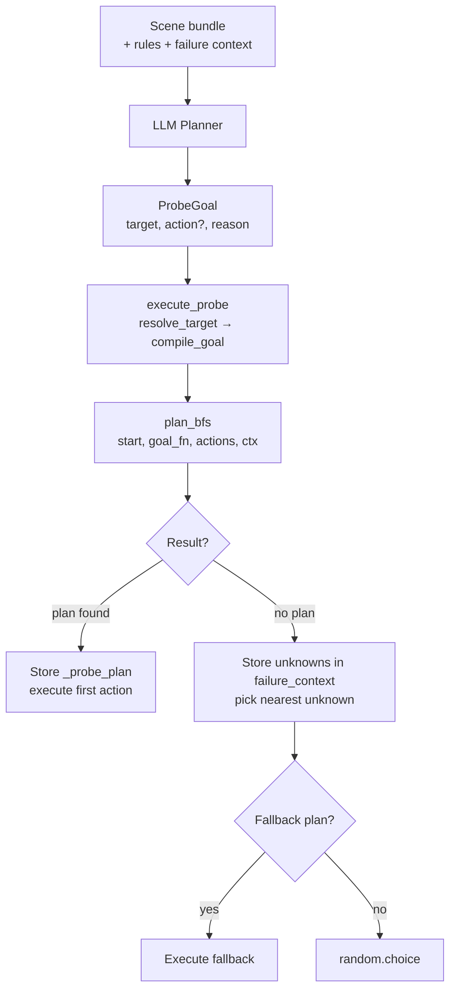
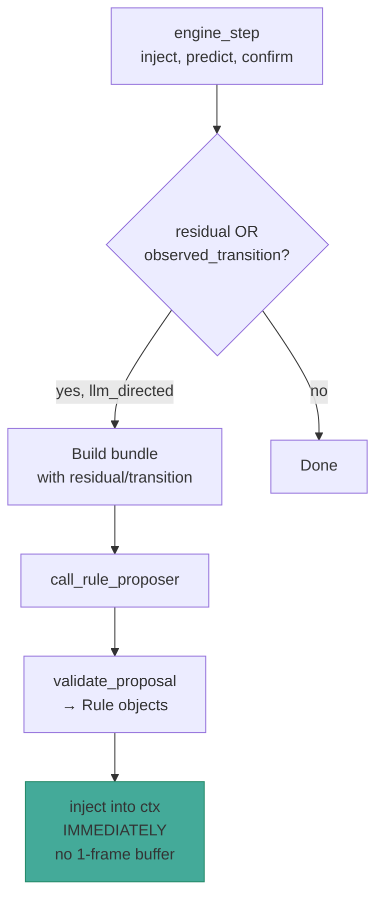
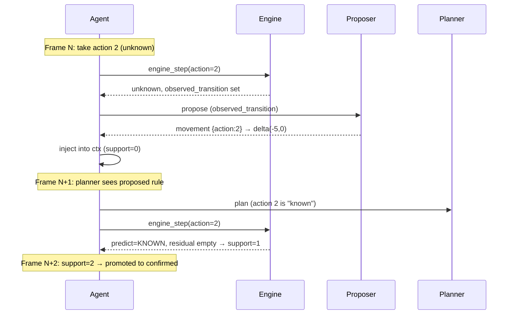
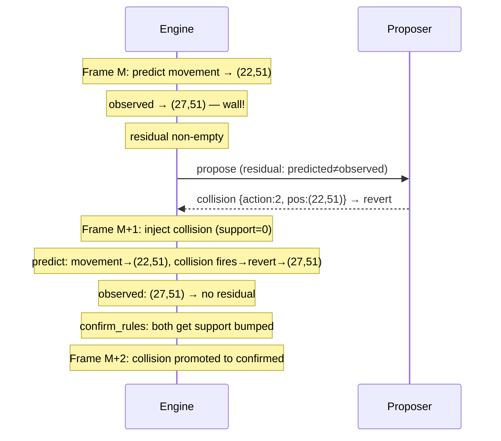

# LLM Curiosity Agent — Design Document

> Architecture and data flow for the `LlmCuriosity` agent.
> Last updated: 2026-07-09

---

## 1. Overview

Perception-first, LLM-directed agent for ARC-AGI-3. Four components:

1. **Perception** — segment objects, track across frames, detect controllable entity.
2. **Effects engine** — predict next states, compute residuals, confirm/prune rules.
   LLM proposer is the sole rule source in the LLM-directed phase.
3. **LLM planner** — proposes exploration goals (`ProbeGoal`) from symbolic scene bundles.
4. **LLM rule proposer** — hypothesizes new rules from residuals and observed transitions.

The LLM is **dev-only**. On the Kaggle eval path, `NULL_RULE_PROPOSER` replaces
the proposer and the planner falls back to classical BFS.

> **Core principle:** LLMs propose, the interaction loop disposes. The LLM never
> sees raw grids — only compact symbolic bundles. The engine verifies everything
> against real observations.

---

## 2. Architecture


```mermaid
graph TD
    PS[PerceptionSession] --> SS[SceneSnapshot]
    SS --> EP[ExplorationPolicy]
    SS --> QI[QueryInterface<br/>bundle for LLM]
    EP --> BFS[plan_bfs<br/>classical BFS]
    QI --> LP[LLM Planner<br/>ProbeGoal]
    QI --> LRP[LLM Rule Proposer<br/>Rule hypotheses]
    EP --> EE[Effects Engine<br/>predict + confirm]

    style LP fill:#4a9,stroke:#286
    style LRP fill:#4a9,stroke:#286
    style EE fill:#69d,stroke:#47a
    style BFS fill:#69d,stroke:#47a
```

### Layer 1 — Perception

`perception/session/` — ingests raw frames, maintains object registry, emits
`SceneSnapshot` with entities, roles, events, step observations.

### Layer 2 — ExplorationPolicy

`planning/exploration.py` — owns the effects context and BFS.

- **Random cold start:** before controllable entity is detected, pick random
  actions. Classical learner (`learn_effect_context`) bootstraps initial rules.
- **LLM-directed:** LLM planner drives. `decide()` is NOT called. Policy runs
  `engine_step` on each observation and provides BFS for probe plan execution.

### Layer 3 — Agent orchestration

`agents/templates/llm_curiosity_agent.py` — phase transitions, probe plan
execution, LLM cooldown, failure context.

---

## 3. Agent loop (per frame)


```mermaid
flowchart TD
    RESET[RESET gate] --> INGEST
    INGEST[INGEST<br/>session.ingest → SceneSnapshot<br/>policy.on_observed → engine_step<br/>if residual/transition → proposer → inject] --> PHASE
    PHASE[Phase gate<br/>random vs llm_directed] --> DIV
    DIV{Divergence?} -->|yes| DROP[Drop plan,<br/>set failure context]
    DIV -->|no| PROBE
    DROP --> PROBE
    PROBE{Active probe plan?} -->|yes| POP[Pop next action]
    PROBE -->|no| LLM
    LLM[LLM planner<br/>→ ProbeGoal] --> EXEC
    EXEC[execute_probe<br/>BFS to goal] --> FALLBACK
    POP --> ACT[Return action]
    FALLBACK{Plan found?} -->|yes| STORE[Store plan,<br/>execute first action]
    FALLBACK -->|no| RAND[random.choice]

    style INGEST fill:#69d,stroke:#47a
    style LLM fill:#4a9,stroke:#286
```

> **Refactor planned.** The current `choose_action` (lines 137-355 in
> `llm_curiosity_agent.py`) is a 220-line monolith with 15 exit points. See
> [§10 Refactor direction](#10-refactor-direction--explicit-per-frame-pipeline)
> for the planned 5-stage pipeline (`_perceive` → `_verify` → `_learn` →
> `_decide` → `_prepare`) with `FrameContext` as the per-frame carrier.

---

## 4. Effects engine

### 4.1 Rule types

| Kind | Guard | Effect | Example |
|------|-------|--------|---------|
| `movement` | action + optional pos | delta/set on `pos` | "Action 1 → move up 5" |
| `collision` | action + pos | revert `pos` | "Action 1 into wall → stay" |
| `terminal` | action + pos | set terminal state | "Action 3 at exit → win" |
| `delta` | action + optional pos | delta on any dim | "Action 5 → size +1" |

### 4.2 Rule lifecycle


```mermaid
stateDiagram-v2
    [*] --> Proposed
    Proposed --> Proposed: guard fires + effect matches → support++
    Proposed --> Confirmed: support ≥ confirm_threshold
    Confirmed --> [*]: used by predict for BFS
```

No automatic pruning. LLM handles refinement via collision rules. Wrong proposed
rules die naturally (never get support bumped).

### 4.3 Prediction

`predict` checks **both confirmed and proposed** rules. If no movement rule
guard matches, returns `Prediction(state, unknown=True)` — the curiosity signal.

Proposed rules make actions "known" so `confirm_rules` can bump their support.
Without this, unknown actions stay unknown forever.

### 4.4 engine_step


```mermaid
flowchart TD
    INJ[Inject proposals<br/>into proposed_rules] --> PRED
    PRED[predict<br/>state_before, action, ctx] --> UNK{unknown?}
    UNK -->|yes| RET[Return ctx]
    UNK -->|no| RESID
    RESID[Compute residual<br/>predicted vs observed] --> EMPTY{residual empty?}
    EMPTY -->|no| PROP[propose_rules<br/>delta/terminal only] --> CONF
    EMPTY -->|yes| CONF
    CONF[confirm_rules<br/>bump support on matches] --> UPD[Return updated ctx]

    style INJ fill:#69d,stroke:#47a
    style CONF fill:#69d,stroke:#47a
```

### 4.5 Two proposer triggers

- **Residual non-empty** — prediction was wrong. LLM sees the mismatch,
  can propose a collision rule or refine the rule.
- **Observed transition** — unknown action was taken. LLM sees
  `(before, action, after)`, can propose a movement rule.

---

## 5. LLM planner


```mermaid
flowchart TD
    BUNDLE[Scene bundle<br/>+ rules + failure context] --> LLM
    LLM[LLM Planner] --> GOAL[ProbeGoal<br/>target, action?, reason]
    GOAL --> EXEC[execute_probe<br/>resolve_target → compile_goal]
    EXEC --> BFS[plan_bfs<br/>start, goal_fn, actions, ctx]
    BFS --> RESULT{Result?}
    RESULT -->|plan found| STORE[Store _probe_plan<br/>execute first action]
    RESULT -->|no plan| UNK[Store unknowns in failure_context<br/>pick nearest unknown]
    UNK --> FALLBACK{Fallback plan?}
    FALLBACK -->|yes| STORE2[Execute fallback]
    FALLBACK -->|no| RAND[random.choice]
```

### ProbeGoal

```
ProbeGoal:
  target: dict   # DSL predicate: near entity, at coords, dim=value, or conjunction
  action: int?   # unknown action to try at target (None = navigate only)
  reason: str
```

### Failure context

When BFS fails, stored as:
```
{ type: "unreachable" | "rule_violation" | "probe_exhausted",
  unknowns: [capped to 5],     # (action, state) pairs where predict=unknown
  last_action, previous_probe_reason }
```

`unknowns` is capped at 5 entries to prevent LLM context explosion (BFS can
produce hundreds of unknown states, each serializing all entity dimensions).

### Fallback unknown probe

On BFS failure, pick the **nearest** unknown (Manhattan distance) and build a
fallback `ProbeGoal` targeting its state with its action. Ensures the agent
tries unknown actions instead of navigating to unreachable targets.

---

## 6. LLM rule proposer


```mermaid
flowchart TD
    ES[engine_step<br/>inject, predict, confirm] --> CHECK{residual OR<br/>observed_transition?}
    CHECK -->|yes, llm_directed| BUNDLE[Build bundle<br/>with residual/transition]
    CHECK -->|no| DONE[Done]
    BUNDLE --> PROP[call_rule_proposer]
    PROP --> VALID[validate_proposal<br/>→ Rule objects]
    VALID --> INJECT[inject into ctx<br/>IMMEDIATELY<br/>no 1-frame buffer]

    style INJECT fill:#4a9,stroke:#286
```

### Immediate injection (no buffer)

Proposals are injected directly into the effects context right after the
proposer returns — not buffered for the next frame. This eliminates the
1-frame delay where `record_step` would use stale context.

### Learning loop example


```mermaid
sequenceDiagram
    participant A as Agent
    participant E as Engine
    participant P as Proposer
    participant L as Planner

    Note over A: Frame N: take action 2 (unknown)
    A->>E: engine_step(action=2)
    E-->>A: unknown, observed_transition set
    A->>P: propose (observed_transition)
    P-->>A: movement {action:2} → delta(-5,0)
    A->>A: inject into ctx (support=0)

    Note over A: Frame N+1: planner sees proposed rule
    A->>L: plan (action 2 is "known")
    A->>E: engine_step(action=2)
    E-->>A: predict=KNOWN, residual empty → support=1

    Note over A: Frame N+2: support=2 → promoted to confirmed
```

### Collision refinement (wall)


```mermaid
sequenceDiagram
    participant E as Engine
    participant P as Proposer

    Note over E: Frame M: predict movement → (22,51)
    Note over E: observed → (27,51) — wall!
    Note over E: residual non-empty
    E->>P: propose (residual: predicted≠observed)
    P-->>E: collision {action:2, pos:(22,51)} → revert

    Note over E: Frame M+1: inject collision (support=0)
    Note over E: predict: movement→(22,51), collision fires→revert→(27,51)
    Note over E: observed: (27,51) → no residual
    Note over E: confirm_rules: both get support bumped

    Note over E: Frame M+2: collision promoted to confirmed
```

---

## 7. Key design decisions

**No classical learner in LLM-directed phase.** `learn_effect_context` only
runs during cold start. The LLM proposer is the sole rule source afterward.

**Proposed rules visible to predict.** Without this, unknown actions stay
unknown forever — `confirm_rules` never runs on them.

**No automatic pruning.** LLM handles refinement. Wrong proposed rules die
naturally (never get support bumped).

**Immediate proposal injection.** Proposals enter `proposed_rules` on the
same frame the proposer returns. No 1-frame buffer delay.

**Ctx synced after every engine_step.** Prevents stale context in the
LLM-directed phase where `decide()` is never called.

**LLM-first control flow.** In LLM-directed phase, `decide()` is NOT called.
LLM always drives. Emergency fallback: `random.choice(actions)`.

**Bundle size caps.** `unknowns` capped at 5, `proposed_rules` capped at 20
in the LLM bundle. Prevents context explosion (BFS can produce hundreds of
unknown entries, each with full state fingerprints).

---

## 8. Key files

| Component | File |
|-----------|------|
| Agent entry point | `agents/templates/llm_curiosity_agent.py` |
| Exploration policy | `planning/exploration.py` |
| BFS search | `planning/search.py` |
| ProbeGoal DSL | `planning/probe.py` |
| LLM planner | `planning/llm_planner.py` |
| LLM rule proposer | `planning/llm_rule_proposer.py` |
| Query bundle | `planning/query.py` |
| Effects prediction | `effects/predict.py` |
| Effects context | `effects/context.py` |
| Effects engine | `effects/engine.py` |
| Rule DSL | `effects/dsl.py` |
| Rule types | `effects/rules.py` |
| SceneState | `effects/state.py` |
| Perception session | `perception/session/` |

---

## 9. LLM call logging

Every LLM call is recorded to a sibling `.llm.jsonl` file for offline analysis.

Why separate from the recording? Reconstructing prompts from `scene` +
`effect_context` requires replaying perception — slow and fragile. Raw messages
are ~2–5 KB × ~50–150 calls/game and make "what did the LLM see?" a one-line
`jq` query.

Event fields: `timestamp`, `guid`, `seq`, `frame_index`, `kind` (planner |
rule_proposer), `trigger`, `messages`, `response_raw`, `latency_ms`, `ok`,
`error`, `truncated`. Messages/responses are truncated at 20 KB per field.

Module: `agents/templates/llm_logging.py` — `LlmCallLogger`, `wrap_llm_call`,
`Recorder.llm_log_path()`.

---

## 10. Refactor direction — explicit per-frame pipeline

> Status: **direction**. Not yet implemented. Captures the agreed plan for
> refactoring `choose_action` into an explicit staged pipeline.

### Problem

`LlmCuriosity.choose_action` is a 220-line method with 15 early-return exit
points. The actual per-frame pipeline — perceive → verify → learn → decide →
prepare — is implicit, buried in nested `if` blocks and scattered `self._*`
fields. Specific issues:

1. **`compute_residual` is computed twice per step.** Once in the policy's
   `_run_engine_step` (stored as `self.policy._last_residual`), once again
   inside `engine_step` (for rule lifecycle). Same inputs, same result, two
   call sites that can drift.

2. **`_run_engine_step` is duplicated ~95%** between `ExplorationPolicy` and
   `RuleFirstPolicy`. The only real difference is `controllable_id` handling
   and `_engine_plan_spec` implementation.

3. **`_record_and_return` is called from 15 exit points.** It does
   `policy.record_step()` — which stores the pre-action `SceneState` for the
   *next* frame's engine step. This couples "record action" with "prepare next
   verify" — a hidden side effect spread across every return path.

4. **Observe + learn are conflated.** The INGEST block (lines 152-191) does
   perception, entity building, grouping, engine step (residual), AND LLM rule
   proposal in one conditional block. These are distinct pipeline stages.

5. **Per-frame state is scattered.** `self._scene`, `self.policy._engine_ctx`,
   `self.policy._last_residual`, `self.policy._last_unknowns`,
   `self._confirmed_groups`, `self._probe_plan`, etc. — no single struct
   carries the per-frame context. Adding new state means threading new
   parameters through every helper.

### Target: explicit 5-stage pipeline

```
Frame
  │
  ├─ 1. PERCEIVE — ingest frame → entities → groups → SceneSnapshot
  ├─ 2. VERIFY   — predict(prev) → compute_residual → engine_step
  ├─ 3. LEARN    — LLM rule proposer (if residual/unknown transition)
  ├─ 4. DECIDE   — phase gate → probe plan → LLM planner → fallback → action
  └─ 5. PREPARE  — store pre-action state for next frame's verify
```

Each stage is a small method. `compute_residual` is computed once in stage 2,
result shared with both `engine_step` (internal) and `_try_propose_rules`
(stage 3).

### FrameContext — extensible per-frame carrier

A frozen dataclass carries all per-frame state through the pipeline:

```python
@dataclass(frozen=True)
class FrameContext:
    scene: SceneSnapshot
    ctx: EffectContext
    residual: tuple[ResidualEntry, ...]
    observed_transition: tuple[SceneState, int, SceneState] | None
    unknowns: tuple[UnknownAction, ...]
    confirmed_groups: list[ConfirmedGroup]
    diverged: bool
    spec: PlanSpec                          # what was tracked this frame
    next_spec: PlanSpec | None = None       # planner-chosen spec for next frame
```

**Why now:** today it carries 8 fields. Tomorrow we add `grouping_state`,
`entity_roles`, `planner_decision`, whatever — one field on the dataclass, no
signature changes upstream. Stages take `FrameContext` and return
`FrameContext` (or action). New state flows through the context, not through
new method parameters.

### Engine plan spec — planner-decided (future)

`_engine_plan_spec` decides which entities/dims to track for residuals. Today
the policy provides a default. The plumbing will let the planner decide this:

```
Frame N:
  _verify  → uses spec (policy default OR planner's choice from frame N-1)
  _decide  → planner sees residual + scene, can emit next_spec for frame N+1
  _prepare → stores next_spec (or falls back to policy default)
```

For now the planner doesn't choose specs — the policy default is used. But
`FrameContext.spec` and `FrameContext.next_spec` are in place.

### run_engine_step — extracted shared function

Both policies' `_run_engine_step` delegate to one function:

```python
@dataclass(frozen=True)
class EngineStepResult:
    ctx: EffectContext
    residual: tuple[ResidualEntry, ...]
    observed_transition: tuple[SceneState, int, SceneState] | None

def run_engine_step(
    ctx, state_before, action, observed, spec, *,
    controllable_id, history,
) -> EngineStepResult: ...
```

The residual is a first-class return value — not a side effect on
`self.policy._last_residual`.

### Policies shrink

After extraction, policies keep only:
- `decide(scene, available_actions)` → action_id (random/BFS phase)
- `record_step(scene, action_id)` → stores pre-action SceneState
- `_engine_plan_spec(scene)` → PlanSpec provider (the one real difference)
- `inject_llm_proposals(proposals)`

`on_observed`, `_run_engine_step`, `last_residual`, `last_observed_transition`,
`last_unknowns` properties all move up to the agent or become unnecessary
(they live on `FrameContext`).

### Incremental plan (4 PRs)

| PR | Scope | Risk |
|----|-------|------|
| 1 | Extract `run_engine_step` + `EngineStepResult`; both policies delegate | Low — pure dedup |
| 2 | Introduce `FrameContext` dataclass; agent builds it, passes to helpers | Low — additive |
| 3 | Split `choose_action` into `_perceive` / `_verify` / `_try_propose_rules` / `_decide` / `_prepare_next`; `_try_propose_rules` reads `fc.residual` instead of `self.policy.last_residual` | Medium — big visible change |
| 4 | Remove dead policy properties + `_run_engine_step` from policies | Low — cleanup after PR 3 |

### What's NOT in scope

- **`compute_residual` refactor.** The signature and logic stay as-is. The
  refactor is about *where* it's called (once, in `_verify`) and *how* the
  result flows (through `FrameContext`), not what it computes.
- **Base `Agent.main` loop.** The `while not is_done` loop stays untouched.
  The refactor is entirely inside `choose_action`.
- **Merging the two policies.** They stay separate; only the shared
  `_run_engine_step` is extracted.